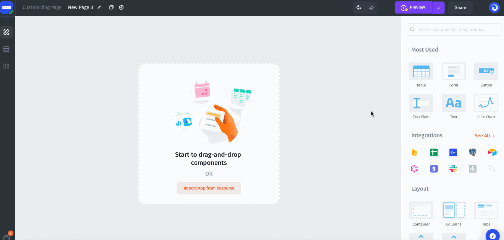
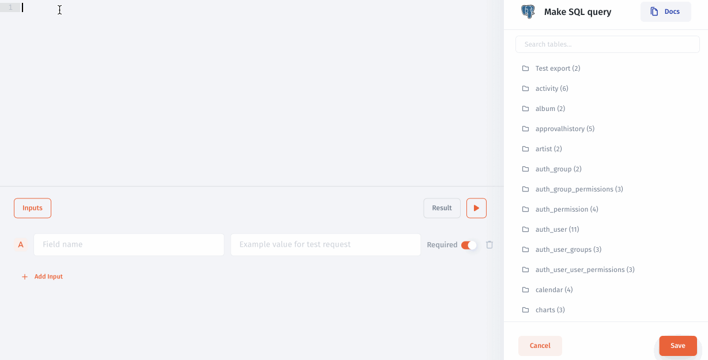

# Making SQL queries

To quickly configure the display of your data from a database, you can build SQL queries by selecting Custom SQL.&#x20;

### Open SQL Query Builder

You can open the SQL Builder directly from the component simply by selecting the SQL resource. The SQL Builder will be opened automatically in case you do not create any collections yet, otherwise you will need to select Make SQL Query from the list of collections for your SQL resource:



### Pass Inputs

To pass [values](../parameters/) from SQL Query Builder, such as `id`or `email`, you need to specify them within the Inputs tab:

.png>)

### Use inputs in the query

For example, you need to select data with a specific `id` or `email`from the table, you can make an SQL query and use the parameters:



### Migrating from old Inputs syntax (before Jet Admin v2.4.0)

Since **Jet Admin v2.4.0** we have changed the way how parameters are inserted in SQL query. Now you don't need to surround parameter value with quotes. **Previously saved queries will continue to work, but you will need remove unnecessary quotes when you will be changing the query (or use compatibility flag described below).**

```sql
SELECT * FROM people WHERE 
city = {{params.city}} 
AND age >= {{params.age}} 
AND name ILIKE {{'%'+params.search+'%'}}

# Before Jet Admin v2.4.0

SELECT * FROM people WHERE 
city = '{{params.city}}' 
AND age >= {{params.age}}
AND name ILIKE '%{{params.search}}%'
```

You can use **compatibility flag** if you want to stay with old parameters syntax, but it will be deprecated at some moment. Just insert the following option at the top of the query.

```sql
-- @JET_QUERY_VERSION=1
SELECT * FROM people WHERE city = '{{params.city}}'
```
