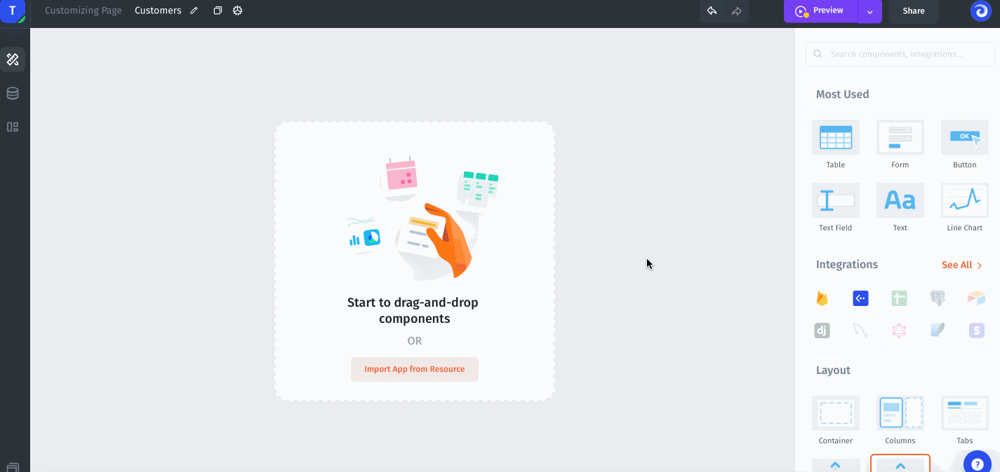
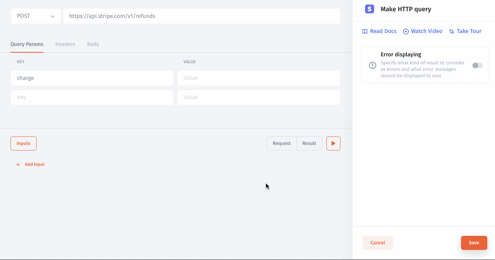
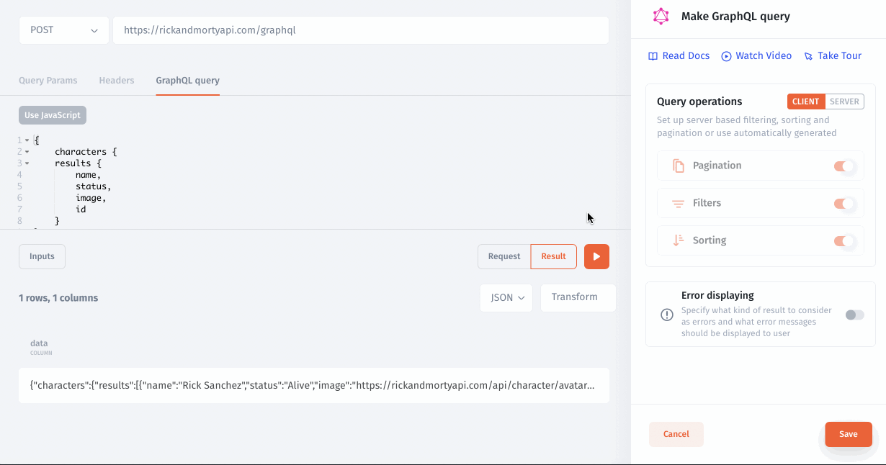

# Making API requests

To quickly connect a custom API use HTTP Request Builder. You can make `GET` request to visualizing orders data in Table component or `POST` request to reset a password for a specific user.&#x20;

.png>)

Watch the video below on how to get API Builder set up!



### Open API Builder

You can open the API Builder directly from the component simply by selecting the Rest API resource. The API Builder will be opened automatically in case you do not create any collections yet, otherwise you will need to select Make HTTP Request from the list of collections for your Rest API resource:



### Pass Values to API Builder

To pass [Values](../parameters/) to **API Builder**, such as `charge` you need to specify **Inputs**.



### Visual Response Transformer

You can transform the data from the response with a Visual Response Transfomer:


### JavaScript Response Transformer

If you need custom transformation you can use a JavaScript response transformer. The`data` is a JS variable that stores a response from your request. Javascript transformation:



For example, you can use JS functions to parse the data:

```javascript
function getProperties(data) {
    result = {};
    for (var key in data) {
        result[key] =  data[key]['value'];
    }
    return result;
}

function contactMapper(contactData) {
    result = getProperties(contactData['properties']);
    result['dealId'] = contactData['dealId'];
    return result;
}
return  data['deals'].map((x)=>contactMapper(x));
```

### Sorting your data

You can sort all fields by ascending and descending value:

.png>)

### Pagination

APIs like to send data back in pages. By default, you only get 1 page. You will need to ask for more. In your API docs, there should be a section called Pagination. To set up Pagination, go to the pagination menu in the API Builder:

<figure><figcaption></figcaption></figure>

There are 3 types of pagination: **page**, **offset**, and **cursor pagination**.

When you choose one of these types, variables will automatically be created that you can use in your query parameters – they will be available immediately available for use in the pop-up menu that appears when you click on a query parameter value or in the URL at the top of the API builder. For example, in the image above, automatically-created variables are used as the values for the parameters _page_ and _per\_page._

.png>)

### Page-based pagination

If you see the mention of a numerical page number that you increment to get each page, then you are in the right place.

Intercom uses this style of pagination; it looks like this in their docs:

.png>)

&#x20;The first page from this endpoint would look like this: `https://api.intercom.io/users?page=0`

```javascript
$ curl https://api.intercom.io/users?page=0 \
-H 'Authorization:Bearer <access_token>' \
-H 'Accept:application/json'
```

In API Builder that would be set up with these settings:

<figure><figcaption></figcaption></figure>

### Offset pagination

If you see the word `offset` in your API docs, this is the style for you. **Hubspot** uses this style. Their docs say:

Some endpoints support a way of paging the dataset, taking an offset and limit as query parameters:

```javascript
https://api.hubapi.com/v1/deals/v1/deal/paged?offset=20&limit=20

```

In this example, in a list of 20 (`total`) singles by the specified deal: from the twentieth (`offset`) deal, retrieve the next 10 (`limit`) deals.

In Jet API Builder that would be set up with these settings:

```javascript
https://api.hubapi.com/v1/deals/v1/deal/paged?offset={{paging.offset}}&limit={{paging.limit}}
```

.png>)

### Cursor based pagination

Sometimes APIs use something that looks weird for their pagination. Each call may return a cursor key to use to get the next page. Something like _"_`nextPageCursor": "<cursor_key>"` or ID as the next cursor (Stripe API) `"next cursor" : data['data'][data['data'].length - 1].id`

For instance, **Stripe** sends back a URL as well as a cursor (object ID) to use to get the next page. Their docs show this:

.png>)

You can send this in two ways. Either use the cursor or use the full URL. If you use the cursor, you need to send it in a parameter.

For instance, Stripe API in Jet API Builder that would be set up with these settings:

```javascript
https://api.stripe.com/v1/customers?limit={{paging.limit}}&starting_after={{paging.cursor_next}}&ending_before={{paging.cursor_prev}}
```

<figure><figcaption></figcaption></figure>
