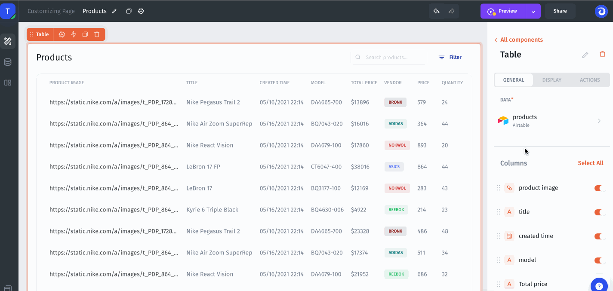
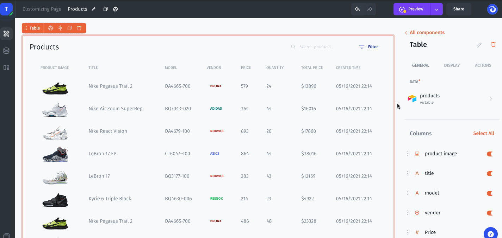
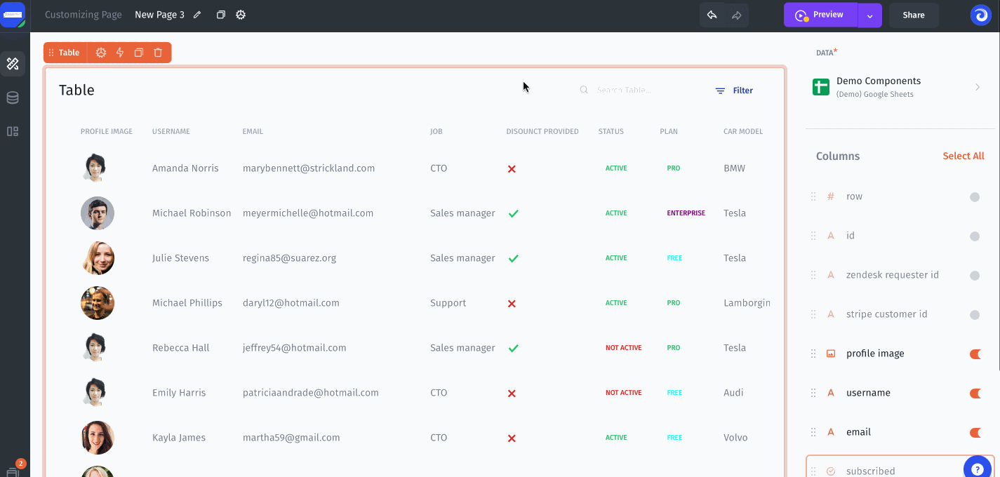

# Managing Columns

### Change the column data type

Change the data type for each column in your component. For example, display the URL of a picture as an image:

### Rearrange the columns

Rearrange the columns in your table:

### Enabling and Disabling Data

You can choose which columns should be displayed in your components:

