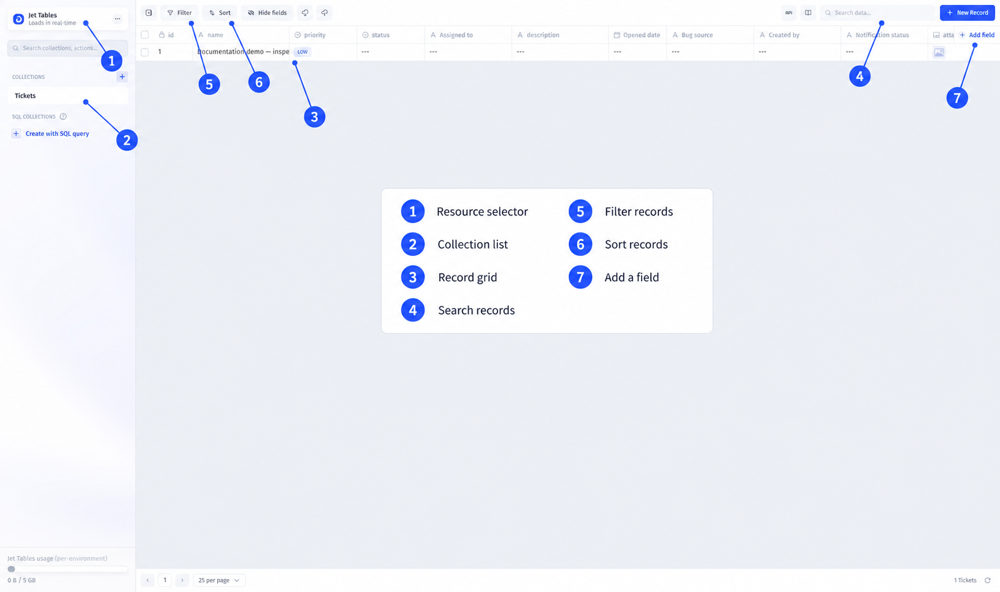
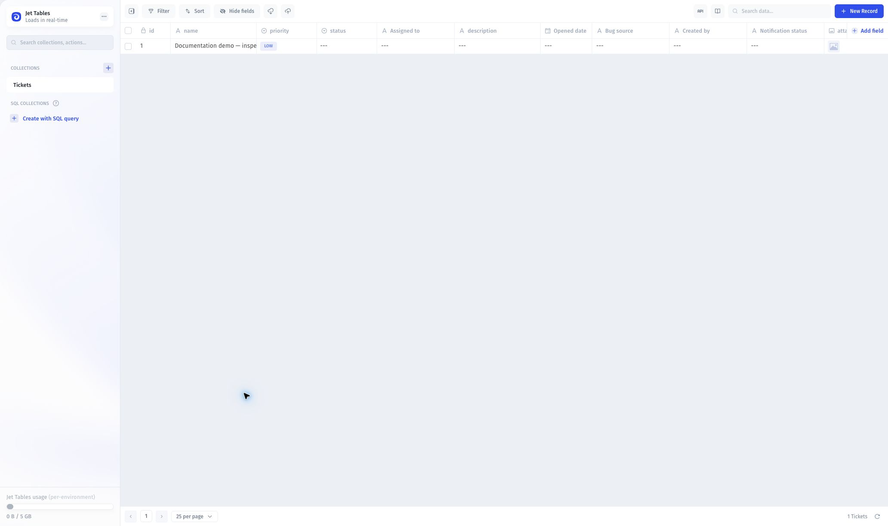
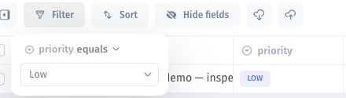
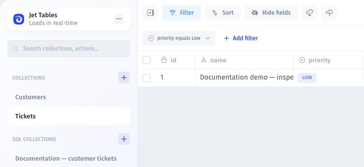

# Navigate the Data Editor

Use the Data Editor to inspect records, arrange fields, and work with the data connected to your app.

## Open your data

1. Open **Data** in your app.
2. Select the resource you want to work with.
3. Select a table or collection to display its records.

Each row represents a record, and each column represents a field. Use the table controls to search, filter, and sort the records you need.

<figure><figcaption>
Annotated overview based on a captured Tickets table. Callouts were added with AI assistance.
</figcaption></figure>

1. Resource selector
2. Collection list
3. Record grid
4. Search records
5. Filter records
6. Sort records
7. Add a field

View the unannotated Data Editor screenshot

<figure><figcaption>
Original screenshot without numbered callouts.
</figcaption></figure>

## Filter records

Select **Filter**, choose a field, and set its condition and value. For example, select **priority**, **equals**, and **Low**.

<figure><figcaption>
Configure the field, condition, and value.
</figcaption></figure>

Close the filter panel to apply the filter, then check the visible records. The matching demo ticket below has ID 1 and Low priority.

<figure><figcaption>
The active filter narrows the view without changing the stored records.
</figcaption></figure>

To remove a filter, open its chip and select the delete-filter icon. View filters are not access-control rules.

## Reorder fields

Drag a column header to move the field within the table. Put the fields you use most often together.



## Pin or hide fields

Pin a field to keep it visible as you move across the table. Hide fields you do not need in the current view; hiding a field does not delete it.



For field configuration, see [Add and configure fields](fields/add-and-configure-fields.md).

## Inspect a cell

Double-click a cell to open its full details. Use this view to inspect long text, JSON, or values that do not fit in the grid.



## Review activity

Use the table's activity logs to inspect recorded changes, including who made an update and when.



## Work with multiple cells

Select multiple cells to work across records, or drag values across rows. Review the selected records and fields before applying a bulk change.



Follow [Multi-Editing and Bulk Actions](records/bulk-edits-and-actions.md) for more detail.

## Continue with a task

* [Add and configure fields](fields/add-and-configure-fields.md): configure your fields.
* [Relations View](relationships/relations-view.md): explore related records.
* [Computed fields](computed-fields/): calculate field values.
* [AI Fields](fields/ai-fields.md): work with AI-assisted fields.
* [Sync schema changes](../synced-tables/syncing-schema-and-data.md): refresh missing tables or fields.
* [Files & storage](../data-sources/storage-and-files/): connect storage and manage files.
