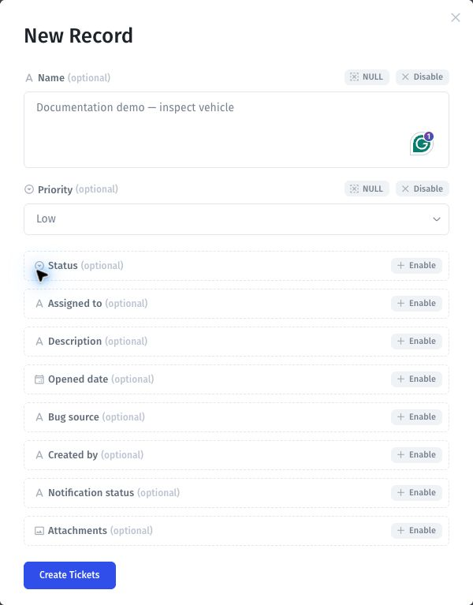
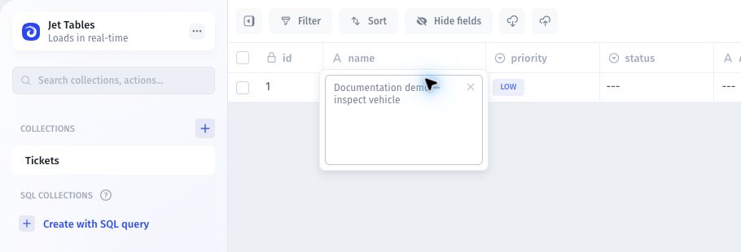

# Records

Work with records after connecting a source or creating a Jet Database.

1. Open **Data**, select your resource, then select its table or collection.
2. Use **Search**, **Filter**, and **Sort** to find the records you need.
3. Open a record or cell to inspect its values. Available editing actions depend on the resource and permissions.
4. After an edit, reload the record and verify the saved value. For an external source, check that source when validating write behavior.

For spreadsheet-style editing, see [Navigate the Data Editor](../new-ui-and-ux.md). For changes across records, see [Bulk edits and actions](bulk-edits-and-actions.md).

A filtered view changes which records you see. It is not an access-control rule.

## Add a record in Jet Tables

1. Open the table and select **New Record**.
2. Enable the optional fields you want to fill in.
3. Enter the values and select the form's create button.
4. Find the new record in the table and reopen it to verify the saved values.

The Tickets template example below shows the **Create Tickets** button. The table name depends on the collection you selected.

<figure><figcaption>
Enable the fields you need, enter their values, and select Create Tickets.
</figcaption></figure>

<figure><figcaption>
The saved demo ticket has ID 1, the entered name, and Low priority.
</figcaption></figure>
