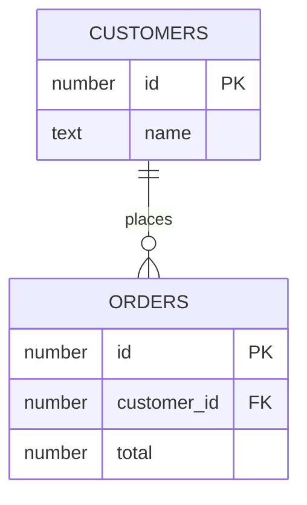

# Relationships

Connect related records using identifiers shared between tables.

For example, each order contains a customer ID that matches a record in Customers. Several orders can refer to the same customer.

* [Link related records](link-records-across-tables.md): configure a related field.
* [Many-to-many relationship](many-to-many-relationships.md): work with records related in both directions.
* [Relations View](relations-view.md): inspect related data.
* [Lookup fields](../computed-fields/lookup-column.md) and [rollup fields](../computed-fields/rollup-column.md): use values from related records.

Use stable IDs for matching. Display names help readers recognize a record but may not be unique. To filter one component based on another component's selected row, follow [Filter related records in Classic App Builder](filter-related-records-in-classic-app-builder.md). Practice with [Customers and Orders sample data](../customers-and-orders-sample-data.md).
