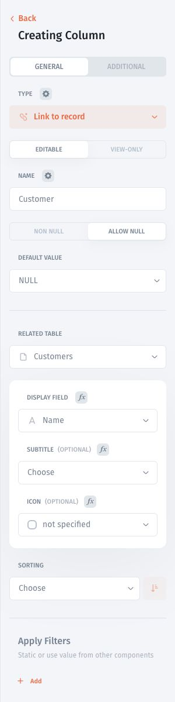
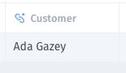

# Link records across tables

Create a relationship using a **Link to record** field. Match stable record IDs rather than names, which can change or repeat.

## Understand the relationship

For example, each order has one customer, while a customer can have many orders:

| Orders.id | Orders.customer\_id | Customers.id | Customers.name |
| --------- | ------------------- | ------------ | -------------- |
| 101       | 1                   | 1            | Ada            |
| 102       | 1                   | 1            | Ada            |
| 103       | 2                   | 2            | Grace          |

A single linked record on each order is the many-to-one side of this relationship. It is not automatically a one-to-one relationship. One-to-one also requires that the customer is used by only one order.

## Configure the link

1. Open the field containing the related record's ID, such as **customer\_id** on Orders.
2. Open its field type and choose **Link to Record**.
3. Select the related **Resource** and **Collection**, such as Customers.
4. Review the related field used to match IDs.
5. Choose a **Display Field**, such as the customer's name, to make the linked record readable.
6. Check Orders 101 and 102: both should resolve to Ada. Order 103 should resolve to Grace.

The related field identifies the record; the display field controls the label you see.

The following existing walkthrough uses Customers and Companies to demonstrate the same configuration:



## Jet Tables example: link a ticket to a customer

In Jet Tables, add a **Link to record** field named **Customer**, select **Customers** as the related table, and choose **Name** as the display field. This form uses the related table's record identity; it does not show a separate matching-field selector.

<figure><figcaption>
Configure the related table and the label displayed in the grid.
</figcaption></figure>

Select the related customer on the ticket. In this separate template-data example, ticket 1 is linked to customer 5, **Ada Gazey**. These sample records differ from the Orders example above.

<figure><figcaption>
The saved link displays the related customer's name.
</figcaption></figure>

## If a record does not link

Check that the target ID exists, both fields use compatible value types, and the target IDs are unique. Check blanks and formatting differences before changing the relationship.

For collections where records on both sides can have several links, see [Many-to-many relationships](many-to-many-relationships.md). To display related values or totals, use [Lookup](../computed-fields/lookup-column.md) or [Rollup](../computed-fields/rollup-column.md).
