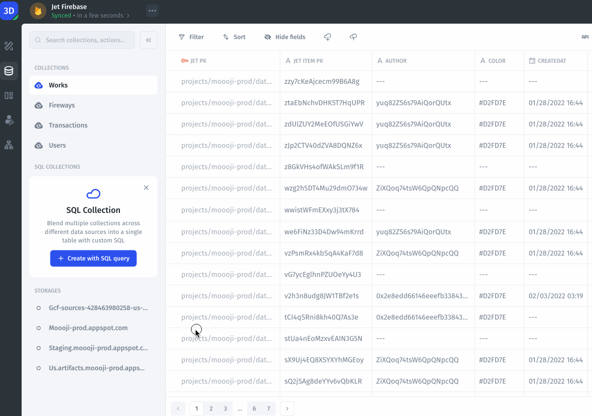
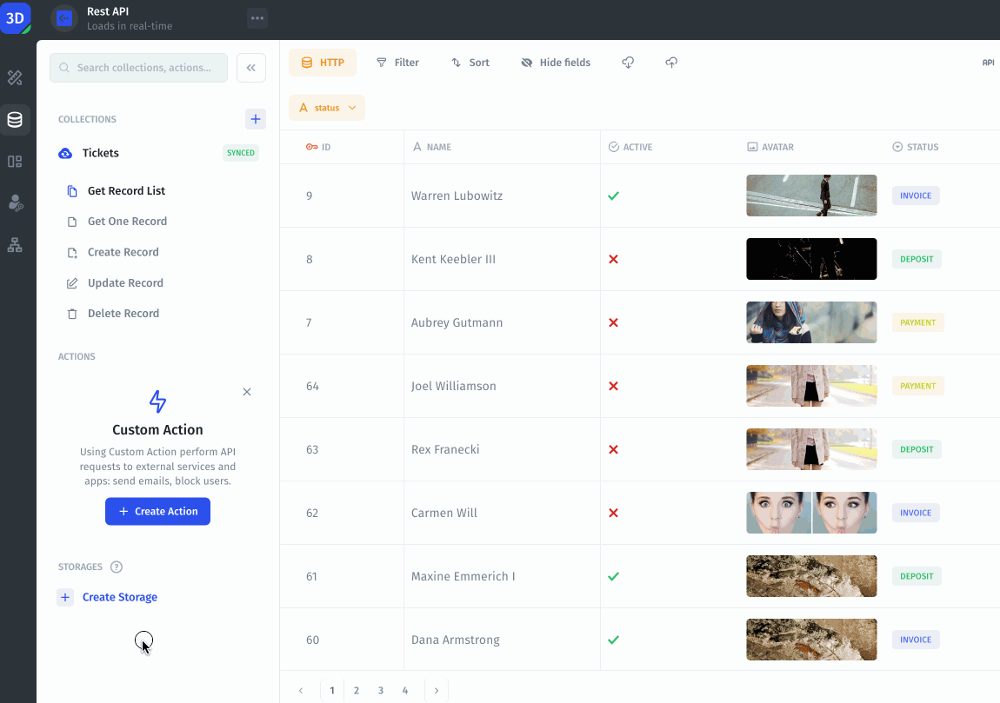

# Syncing Schema and Data

If you make any changes to your schema or data, such as adding new tables or fields, this will not appear immediately in Jet. Run a manual sync directly in Jet to see the changes.

## Run Schema Sync 

Jet automatically doesn't sync the schema structure, you can manually run a schema sync as an admin whenever you need in order to see changes reflected straight away.

<figure><figcaption></figcaption></figure>

### Run Schema Sync for Rest API

<figure><figcaption></figcaption></figure>

## Run Data sync 

When you or your users make changes to your data in Jet, those changes are reflected immediately in your data source.

When updates are made directly in your external data source - i.e. Airtable, Google Sheets, Stripe etc - they will be visible in Jet up to **5 minutes** depending on the sync interval. This is because we re-cache the data every N minutes. You can manually run **`Sync now`** or specify the **N sync interval.**

### **Sync now**

<figure><figcaption></figcaption></figure>

### Specify N sync interval for Rest API

<figure><figcaption></figcaption></figure>
