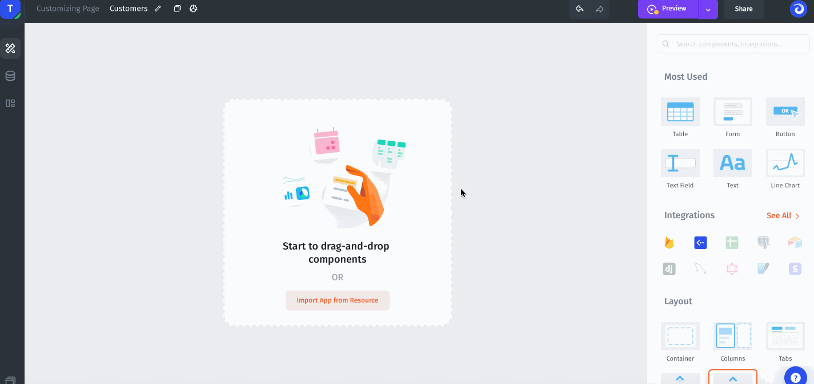

# Actions

Action is an operation that you can perform in Jet Admin. Visually, the action is a button in the Jet Admin interface.

To add an action you need to select a Button component and drag-and-drop it on the page.

### Action types

There are 9 types of actions:&#x20;

* **Run operation**. Perform any CRUD operation or custom API/SQL query.&#x20;
* **Navigate to page**. Passing values and switching between pages.
* **Open URL.** Open the link in a new or the current tab.
* ****[**Open Modal/Close Modal**](../components/modal.md)**.** Open or close the pop-up modal window.
* ****[**Run Component Action**](../components/component-actions.md)**.** Perform an action on a component, such as updating data or clearing the form after submitting.
* ****[**Show Notification**](../components/custom-notifications.md)**.** Show custom notification.
* **Export Data.** Export data from the table.
* **Download File.** Download the file from the API call.

.png>)

### Run Operation

You can perform any CRUD operation or a custom API/SQL query:

### Navigate to Page

Passing values and switching between pages:

### Open URL

Opens any website URLs, use **Action** specified as **Open URL**.

### Open/Close Modal

Open or close the pop-up modal window:


[modal.md](../components/modal.md)


### Run Component Action

Perform an action on a component, such as updating data or clearing the form after submitting.


[component-actions.md](../components/component-actions.md)


### Show Notification

Show custom notification.


[custom-notifications.md](../components/custom-notifications.md)


### Export Data

Export data from the table.

