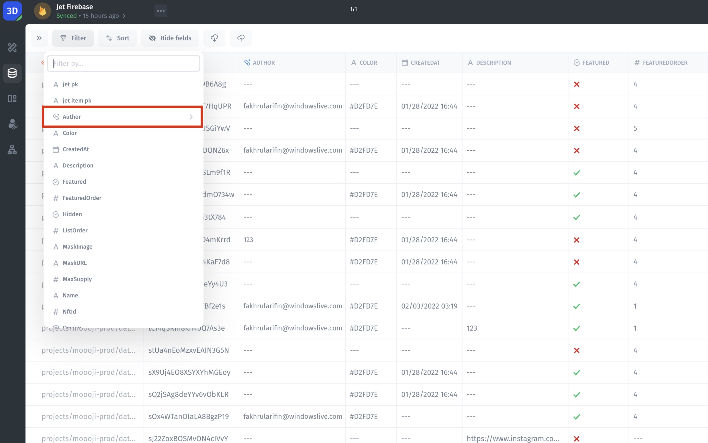

# Advanced Filters

Using advanced filters in the database helps you find exactly what you need by narrowing down the information to specific values. It's like a smart search that saves time and ensures you get the right data. Whether you are looking for specific records or making detailed reports, these filters make your search easier and more accurate.

<figure><figcaption></figcaption></figure>

Let's apply an Advanced Filter in the Resource. To do it, follow the steps:

1. Click on the `Filter` button
2. Choose the **DateOfInspection** field, to filter by that field
3. Choose the **Date** to filter by
4. Choose the **Time** to filter by
5. Apply the filter



