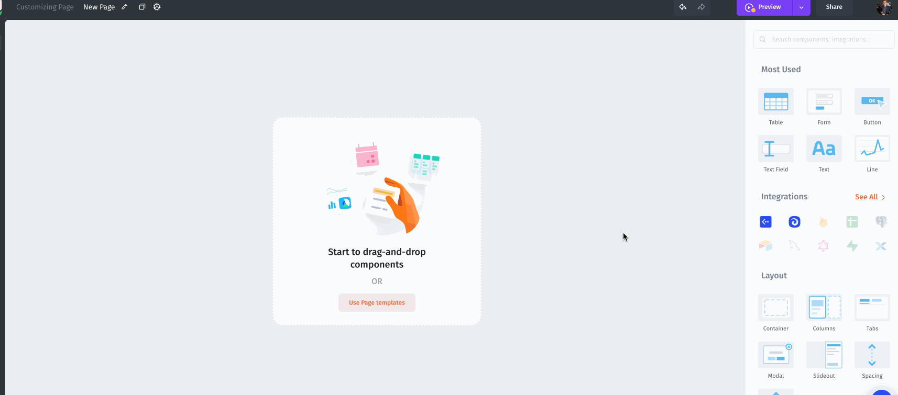

# File PDF Viewer

<figure><figcaption></figcaption></figure>

1. Drag-and-drop **File Viewer** from Component Library in Visual Builder.

.png>)

<figure><figcaption></figcaption></figure>

There are two Viewer types:&#x20;

* Browser built-in. Faster, works with non-public URLs
* Google File Viewer. More supported formats

 (1).png>)
