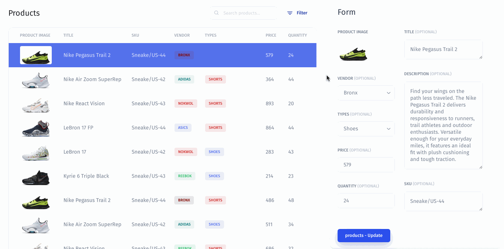

# Examples

### Example 1: Verify inputs before submission

Sometimes you may have a process where a user needs to fill out the data fields correctly, prevalidating them (e.g., correctly typed **phone number** or **email**). To do this, you can set the Validator to the desired data field.

For setting validation for the Email field, follow the steps:

1. Click on the **Email** field
2. From the right menu, go to the **Display** tab
3. Scroll to the **Validate** section and choose **Email**



Now unless the user has entered the correct Email it will not be possible to submit the Form:



### Example 2: Verify the required fields are filled in

Sometimes you need to make some fields required so the user can't submit a form without specific details.&#x20;

For marking the Phone field required, follow the steps:

1. Choose the **Phone** **field**&#x20;
2. From the right menu, go to the **Display** tab
3. Check the **Required** option&#x20;




Now unless the user has entered the **phone number** it will not be possible to submit the Form.


### Example 3: Add a placeholder for the fields

Sometimes you need to add a specific placeholder for a field to hint to the user.&#x20;

For adding a Placeholder for the email field, follow the steps:

1. Choose the Email field
2. From the right menu, go to the **Display** tab
3. Set a Placeholder



### Example 4: Make some fields hidden

Sometimes you need to configure Visibility rules for form fields so that the user can see new fields if the previous ones are filled. To do this, just configure Visibility for the desired data field.&#x20;

Let's make the **Email** field appear only if the **Customer first name** field is filled in:

1. Click on the `Email` field
2. Go to the **Display Tab**
3. Click on the `Conditional Visibility` to set a **Formula**
4. Choose **First Name**



Now, unless the Customer name field is filled in, the user will not be able to fill in the Email field:



See here for more details on Conditional Visibility:


[conditional-visibility.md](../../../components-visibility/conditional-visibility.md)


### Example 5: Update the data of the selected row

Let’s say you have a table of Products for your business. Before sending these Products over to be processed, you want a user to review and sanity-check the data in the Product, like the Quantity and Price.

You can create a form that displays the Product data, prefilling each field (like Quantity) with the current value in an editable text box. Users can quickly scan the form to review and hit a "Confirm" button to confirm the product or fix any errors they notice before confirming.

We’ll cover a step-by-step example of binding to pre-existing values below.

To bind data from a table to a form, you need to generate a form first with the same resource and collection (Airtable - Products) by selecting the operation type (in our case it is Update operation). Follow the steps:

1. Click on the **Form**
2. Click on the **Run Operation**
3. Choose the **Resource**
4. Choose **Update Record** as the **Form Submit Action**
5. Click on the `Generate` button



Next, you need to apply filters, namely a data filter on the primary key (in our case it is the product ID). This step is important for the form to display exactly the data you selected in the table (selected row). Follow the steps:

1. Click on the `Add Filter` icon
2. Choose **ID equals**
3. Click on the `Formula` icon to apply the Filter by using a Formula
4. Choose **Table**
5. Choose **Selected Row**
6. Choose **ID**
7. Click on the `Generate` button



### Example 6: Sequence of Forms

In most cases, you need to create a sequence of forms in which filling out one form should redirect the user to another form. See here for details:


[actions-workflow.md](../../../workflow/actions-workflow.md)

