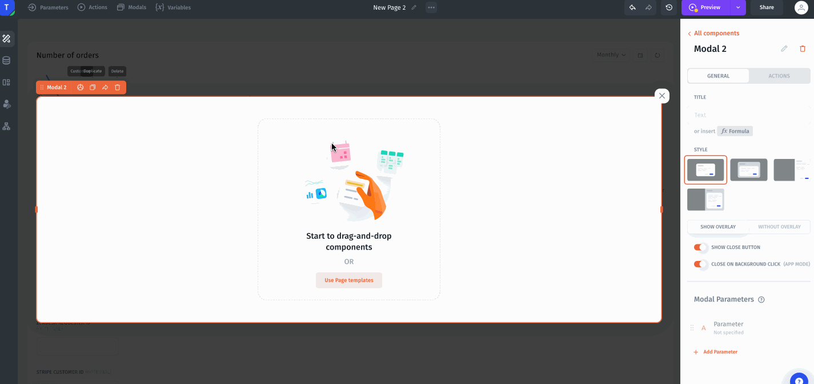
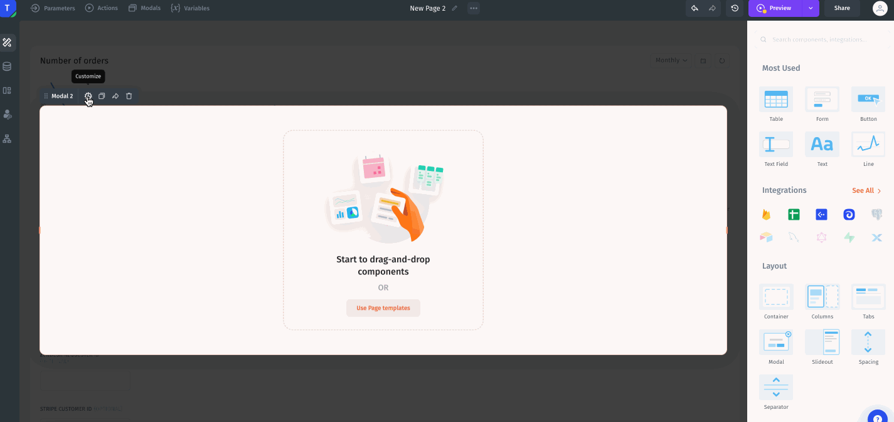
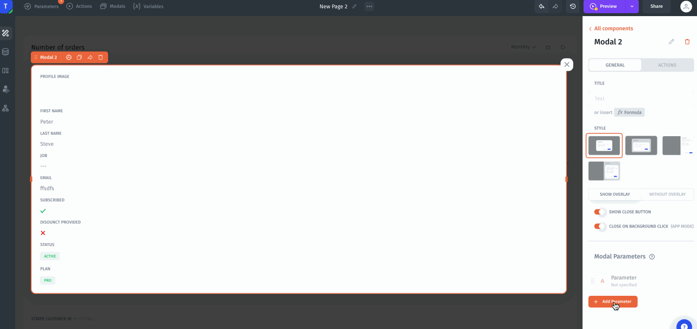
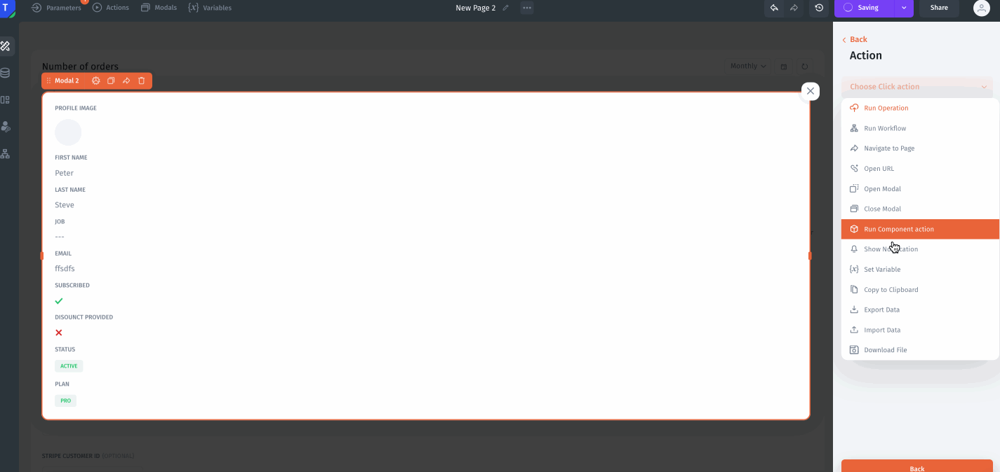
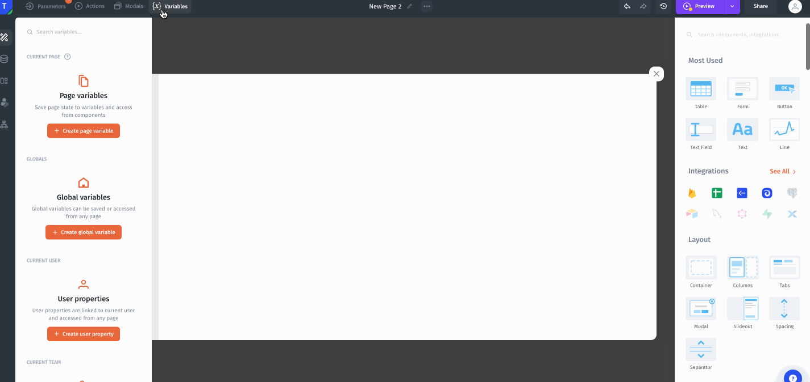

# Modal

<figure><figcaption></figcaption></figure>

You can customize your modals with options like showing a close button and enabling closure when clicking the background overlay.

<figure><figcaption></figcaption></figure>

You can pass dynamic parameters from the page into your modals, allowing you to populate them with contextual data.

<figure><figcaption></figcaption></figure>

Modals support adding custom actions, giving you flexibility to build interactive workflows.

<figure><figcaption></figcaption></figure>

You can define variables in your app and seamlessly pass them into modals to populate dynamic content and behavior.

<figure><figcaption></figcaption></figure>

