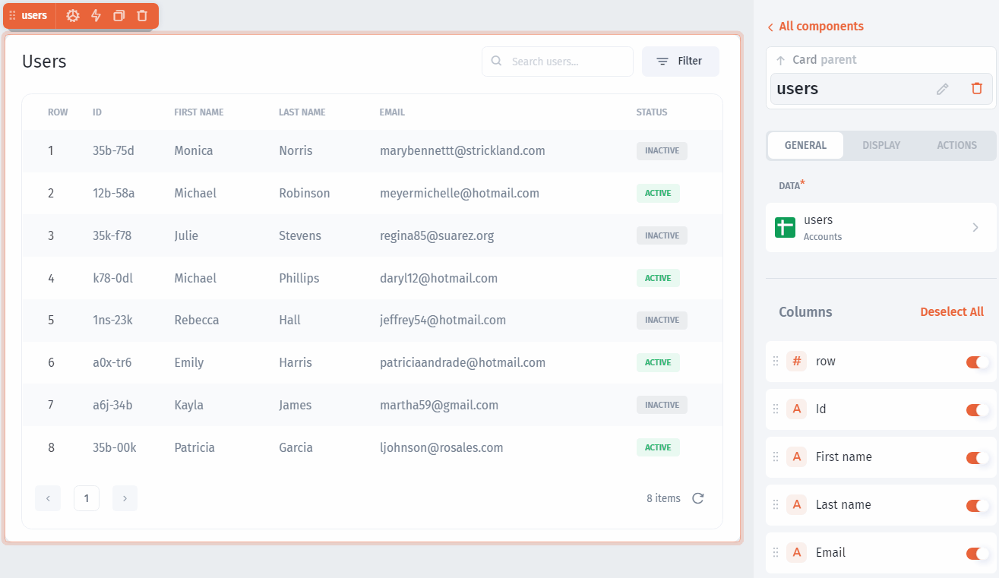

# Table

### Table component

Use `Table` component to view and interact with data from your collections:

.png>)

### Adding Table&#x20;

Adding components explained [here](../../../../components/lists/#adding-list-component).&#x20;

### Table Settings

You can customize any component in Jet Admin and the Table component is not an exception. You can rearrange columns and enable/disable them:



On top of it, you can customize each field individually, for example, change the name of a column or change the field type:


### Search

You can enable Search for your table, just enable the flag:


### Selection function

Any `table` in Jet Admin has the `selected row` function that can be used to trigger all sorts of actions as well as fetching values from selected records:


### Grouping Rows in Tables

Jet Admin lets you group table rows together to better organize your data.\
To do this, go to the Display section and scroll down to 'Group By'.

<figure><figcaption></figcaption></figure>

Choose the field to group rows by, enter a label for each group, and pick a color to highlight the groups.\
\


<figure><figcaption></figcaption></figure>

### Grouping Rows in Tables

Jet Admin lets you group table rows together to better organize your data.

To do this, go to the Display section and scroll down to 'Group By'.

<figure><figcaption></figcaption></figure>

Choose the field to group rows by, enter a label for each group, and pick a color to highlight the groups.

<figure><figcaption></figcaption></figure>

### Hiding Filters from Filter

Hiding fields lets you only show preferred filters in the list.

Go to 'Display Filters' and you can disable all filters, which removes the filter icon completely.

Or choose to hide some filters by clicking the toggle button next to each one.

<figure><figcaption></figcaption></figure>

### Statically Filter Data Using JavaScript

To filter your data statically in a table with more than one value, in this case we need to use JavaScript.

For example, if we have data with different statuses (New, Started, Blocked, and Completed). And we need to show data only with statuses "Blocked" and "Completed".

First we need to choose a column to filter by then use the filter "one of"

<div align="left">

<figure><figcaption></figcaption></figure>

</div>

Then activate the formula

<div align="left">

<figure><figcaption></figcaption></figure>

</div>

Then click on the **JavaScript** button, and  type the code below:

```
let arr = ["Blocked","Complete"]; 
return arr;
```


Values inside the JavaScript code are case sensitive. beware of the capital and small litters&#x20;


This will result to showing only records with statuses "Blocked" and "Started" as shown in the image below:\
​

<figure><figcaption></figcaption></figure>

​\
​\
​\
​

\
​

##
