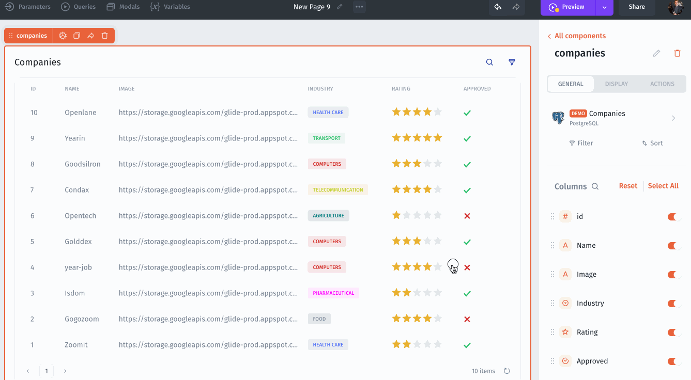
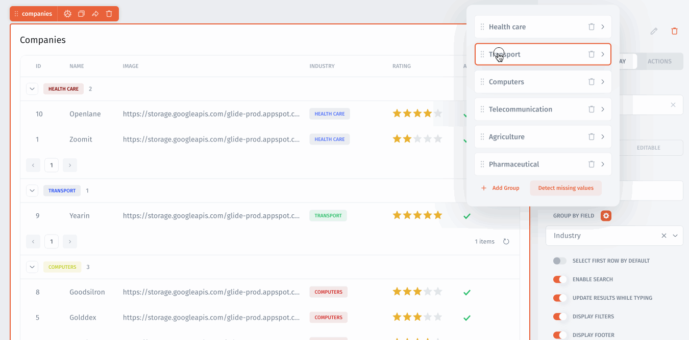

# Grouping records

<figure><figcaption></figcaption></figure>

To group your records, drag-and-drop Table, go to **Component Settings** -> **Display**  and click on the **Group by Field** field located after the Rows per page. Select from the suggested fields. Jet automatically detectes all values from the Group field. Click **Add Group** to add missing groups.

<figure><figcaption></figcaption></figure>

### Drag a group to move its order of grouping

Rearrange groups in **Group by Field** popup

<figure><figcaption></figcaption></figure>

### Show/Hide groups on conditions&#x20;

<figure><figcaption></figcaption></figure>

