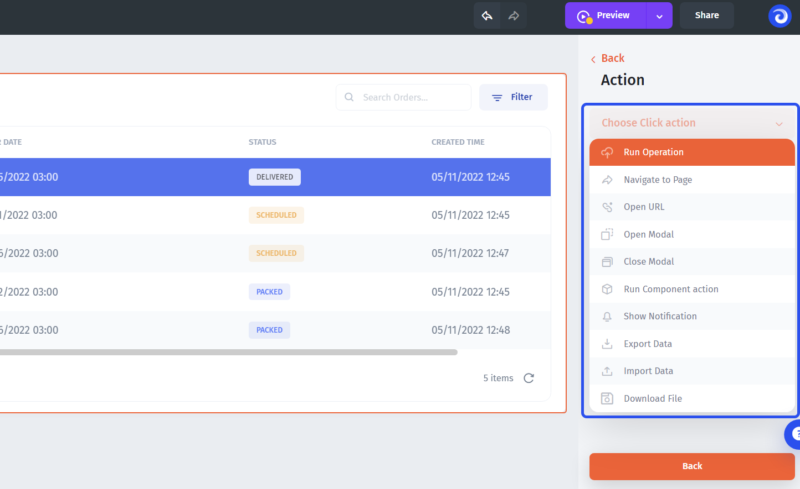
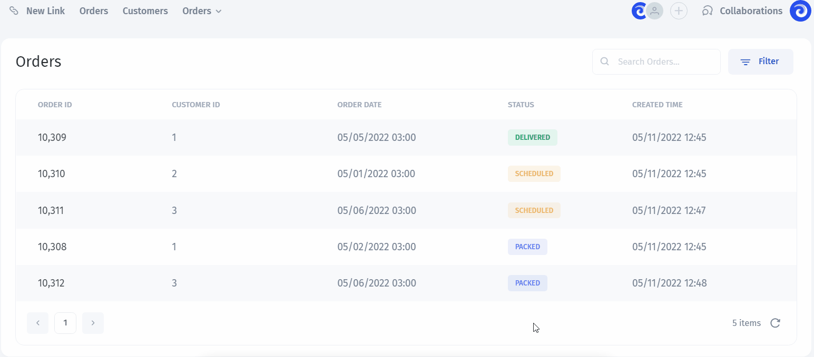
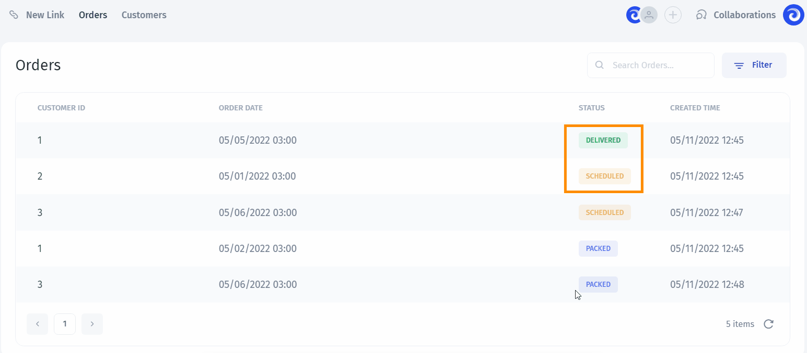

# Table Actions

## Actions

Table is an interactive component which means you can bind all **different kinds of actions** to it. You can configure:

* Row click
* Rows check
* Inline action
* Header action
* Hover action

To proceed to the actions, select the table and click on the **"Actions" tab**:


For the **Hover action**, you'll need to drill down into an individual column in the column settings (see the "Hover action" section below)


### Row click

When the Row click action is enabled, the specified action will be executed once a row is clicked. You'll be able to use any value from a selected row in the action. Now, click on it:&#x20;

The most **common use-case** for the "Row click" action is drilling down into the record or proceeding to the page with more record-related data (you'll need to use the "Navigate to Page" action type for that). But you are free to use any action type.


Learn more about different types of actions in the [Types of action](../../../actions.md) section


Here's an **example** of how that might look in the user-mode:


**It's crucial** to understand how **data is bound** under the hood when linking pages. Otherwise, things might break when customizing the auto-generated pages or building the drill-downs from scratch.&#x20;

Please, **read more** in the [Values section](../../../../parameters/)&#x20;


### Rows check

The Row check action allows you to execute actions using data from multiple rows. Click on it:&#x20;

Here's an **example** of how that might look in the user-mode for when we've set the "Row check" action to change the statuses of the checked rows to "Packed":


Learn how to set up this or other **CRUD** (Create, Read, Update, Delete) use-cases in the [Values section](../../../../parameters/)


### Row action

If you want to add action buttons inside of **individual rows**, you should use "Row actions"(Inline actions):

As an example, here's the action that fetches the status from the row in which the "Inline action" was clicked and uses it in the notification pop-up:

When you add a Row action you often need to pass some value from the row the button was clicked on. For that you always have access to the context of the current row the button was clicked on. You just need to pass the desired value to the input parameter that is necessary to perform your action. The example below shows how to run a Workflow specifically for the desired row with the value from that row:&#x20;



### Header action

Header action allows you to set up an action and put the button in the **"Header" of the table**. By default, all header actions will be hidden in one dropdown button, but you have an option to pin an individual header action for better visibility.&#x20;

You can create multiple header actions and **pin** the ones you'd like to see on top:

Here's an **example** of two header actions in the dropdown and executing the pinned one (downloading the whole list of orders):

.gif>)

### Hover action

Hower action helps set up actions, specific to certain fields or columns. When you **hover your mouse** over the field, the action, otherwise hidden, will show up.

To access it, select the table and drill down into the column that you want to enable it for:

Then go to the "Actions" tab:

Here's an **example** of a "Hover action", triggering the modal popup and pushing the `Order date` there:


**Learn more** about using **modal popups** and how to configure them in the ["Modal component" section](../../../../components/modal.md)



[lists](../../../../components/lists/)



[actions.md](../../../actions.md)

