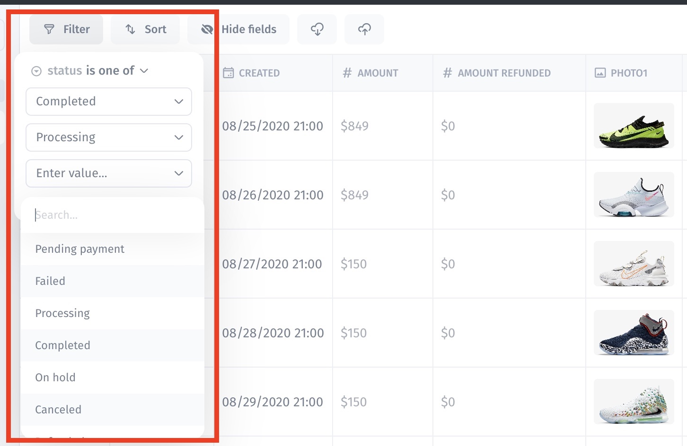
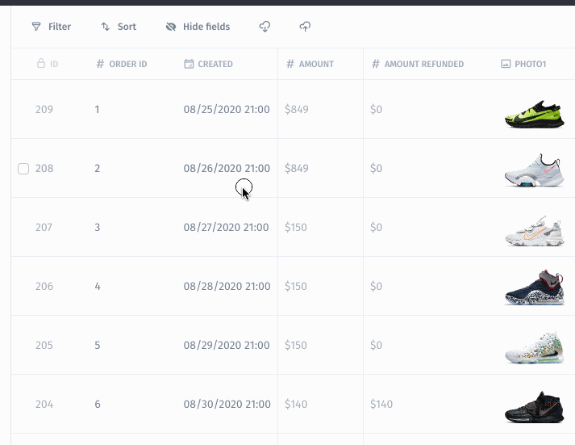

# Filter

### Filter your collection

Filter your data with automatically generated filters:

### Filter by multiple values – One of

<figure><figcaption></figcaption></figure>

<figure><figcaption></figcaption></figure>
