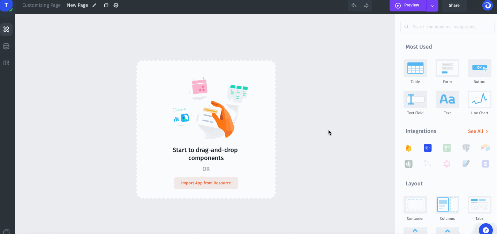
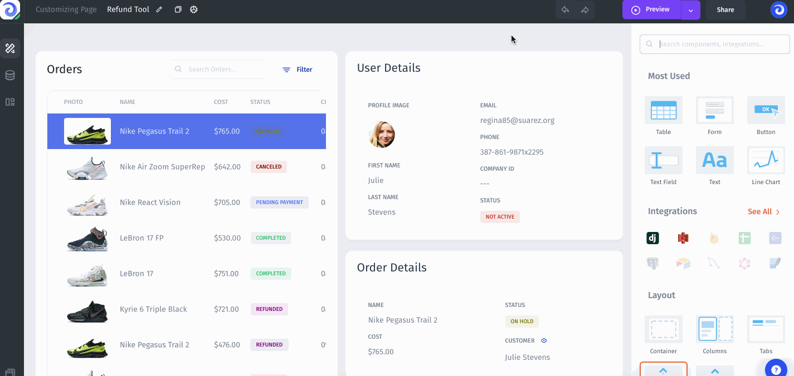
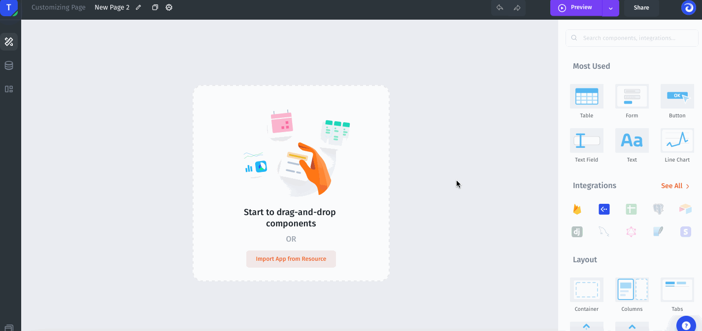
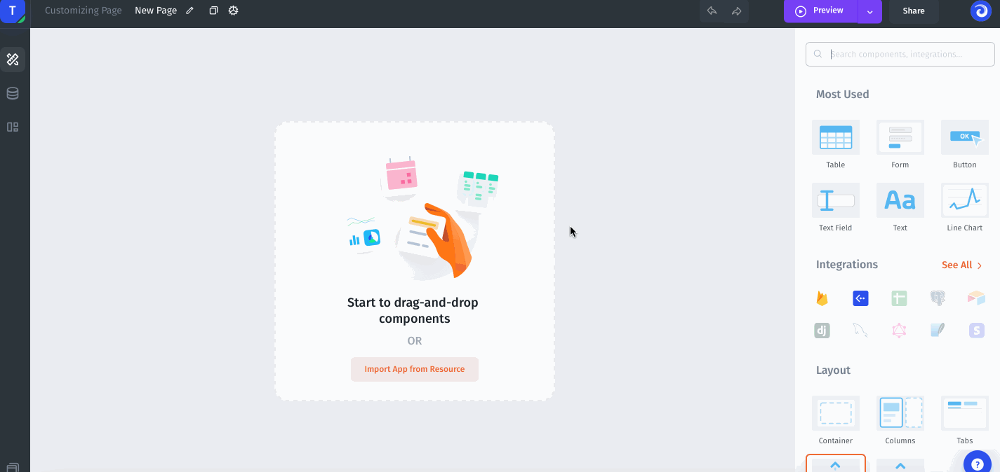
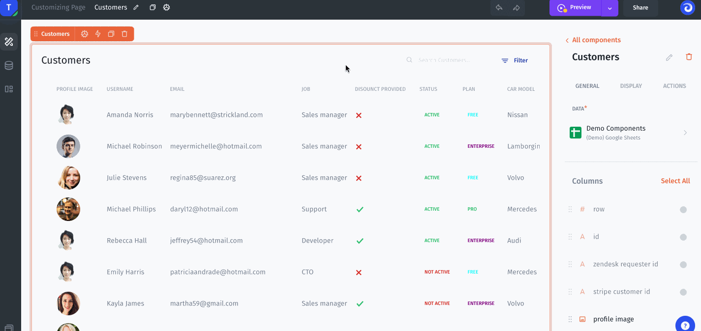

# Customizing Pages



A Page is an interface element that can span across various use cases. Create pages from scratch or generate an Admin Panel to get your application ready in less than 2 minutes.

### Create a new page

To create a new page, click on Pages icon on the left menu in Builder mode and click the Create new page icon.

### Copy your page

To copy the current page, click the Duplicate the page icon next to the page settings:

### Customize your page

Once you created a new page, drag-and-drop any components to the page to succeed with your use cases.


[components](../components/)


### Page Values

Page Values allow you to pass data from one page to another.&#x20;


[parameters](../parameters/)


In case, when you want to build a Detail page for your user with the user info on this page: first name, last name, address, etc. You need to pass the user ID from one page to another. To do this you need to create a page value for this page and pass this ID to another page in [Action](actions.md).&#x20;

### Create page values

To create page value go to the page settings then click **+Add Parameter.**

### Link pages

In order to pass a value from one page to another, you need to use the Navigate to page action.

## Page Queries

Page queries allow you to do queries from your page at once, and then use query results for all of the components on the page. In case, if you use one Query for several components, Page Queries help you to load it once and optimize the page loading.



**Choose Page Query Type**

* Get one record – a query returns the one record&#x20;
* Get the list of records – a query returns the list of records

 (1) (2).png>)

Specify Page Query's Data on your Component using Formula

 (1) (2) (1).png>)

