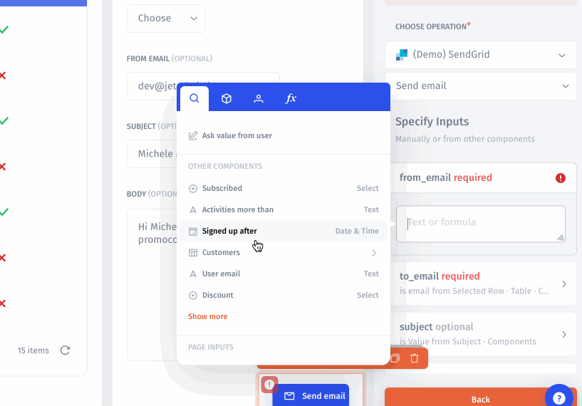
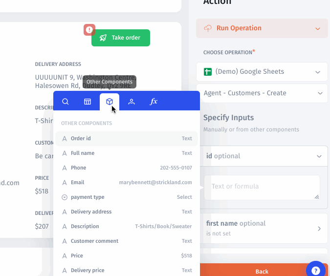

# Formula

A formula is a method to access every piece of data and build up to as complicated a data flow pattern as you need it to be. You can combine, modify, or calculate the values, or you can even pull up an access control system based on logical conditions set by an appropriate formula.

Let's build a basic example.

1. Click on the `Add Column`
2. Choose to `Add a Computed Column`
3. Rename the **Label**
4. Click on the `Set up with Formula` icon
5. Go to the **formula's tab**
6. Choose **Concat** -> **First name** and **Last Name**
7. Add a **separator** to the **Expression**



### Basic Math Operations

In a formula, you can reference columns by name and use these to do mathematical calculations. For example, if you wanted a formula that calculated the total based on the price and quantity, the formula would look like:

```
= Price * Quantity
```

### Functions in Formulas

Jet Admin also has several useful functions that you can use in your formulas.

**A key thing to remember when using functions is that&#x20;**_**a message will appear that shows you exactly how to use each function when you click on it.**_ This way, you never have to remember or think about how to use a given formula, you can simply read how to use it and enter or choose the values you need from the menu. \


There are four different groups of built-in functions:

* General Functions – e.g. CONCAT(), IS\_NULL(), LOWER()
* Logical Functions – e.g. IF(), EQ(), AND()
* Mathematical Functions – e.g. ROUND(), ABS(), SUM()
* Date & Time Functions – e.g. NOW(), MONTH(), IS\_DATE\_AFTER()

**Simple Example:**\
You have a table where _First Name_ and _Last Name_ are separate fields, but you would like to concatenate them to display them in one field.

1. Select your table, and then click on _Add Computed Column_ in the component menu.
2. Click on the _ƒx Formula_ button next to the value field.
3. Select or search for the CONCAT() function in the menu that appears.
4. Enter the values that you want to concatenate. Like the message shows when you select CONCAT(), the appropriate syntax is CONCAT(_VALUE1,_ _VALUE2_). _VALUE1_ and _VALUE2_ can be fields in your table, or they can be something else (e.g. a string in quotes: "string" – this might be useful for adding a space between table values). For this example, the final result will look like this:

```
=CONCAT(first_name, " ", last_name)
```

**Let's see how you can make use of Jet Admin formulas.**

### Setting up promotional email

For an introductory example, we will consider feeding customers' email addresses to promotional emails. Once the user is selected in the Customers table, his or her email should appear in the `Email` field to send a promotional Email with a Marketing tool. We will use Functions as well to create a Promotional Email template.


[setting-up-promotional-email.md](computed-columns/formulas/setting-up-promotional-email.md)


### Create Custom fields using Formulas

In this use case, we will create a custom column in the Customer table and calculate a score depending on some logical condition.


[create-custom-fields-using-formulas.md](computed-columns/formulas/create-custom-fields-using-formulas.md)


### Formulas variables

Essentially, this is a tabbed pop-up window that reflects all the components on the current page, a list of functions, and a set of filters to manage data in the selected table.&#x20;

The number and type of tabs depend on the context. This allows the user to have access to only those tools that apply to the objects he or she is working with. For example, if we work with table parameters, there will be a tab with filters. In case we drill down to a specific record of a table and have these record fields displayed on a page, a tab with Record components will be available:&#x20;



### Tabs context

When you configure the table parameters, the features displayed in the Formulas window will fit the component context, e.g. there will be a new tab with `Filters` to set up filtering for selected table or a tab with [User properties](security-and-privacy/user-and-team-properties.md) if any exists. Let's walk through the possible context Tabs.

#### Search tab

In this tab, you see a general list of all available interactions with the current component or other components and parameters.&#x20;


#### Current component tab

When you are working on a Current Component setting, the context in the formulas will show you the Current Component setting at the very top. In this tab, you can only access the fields in the current component:


#### Components tab

Here you can access any data from your resources through any component (fields, tables, charts, etc.) on the current page.



### User-specific properties

If you want to restrict access for a User or a Team to data that is relevant for their work within a JetAdmin app, you can quickly access the [User & Team properties](security-and-privacy/user-and-team-properties.md) in these tabs and assign the user or team ID to the data columns which should be visible for them:&#x20;


You can create custom columns in a table to handle cases such as math operations on your data, parsing JSON fields, or creating conditions. Let's look at a few examples of how to use it:

#### App and Environment properties

Use the App name and Environment name properties in your Application to filter your data.

&#x20;

#### Device properties

Device screen size tokens in Jet Admin enable you to reference and utilize specific properties related to the screen size of various devices. These tokens ensure that your applications are responsive and optimized for different screen sizes, enhancing the overall user experience.

You can utilize these tokens to create rules or conditions that adapt the interface based on the device type and screen size. For instance, you might want to show a different layout for desktop users compared to mobile users

<figure><figcaption></figcaption></figure>
