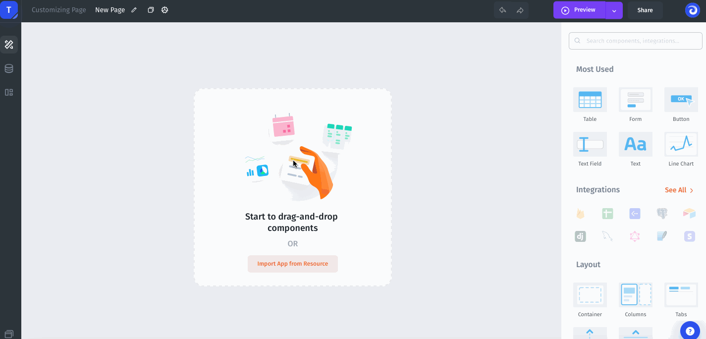
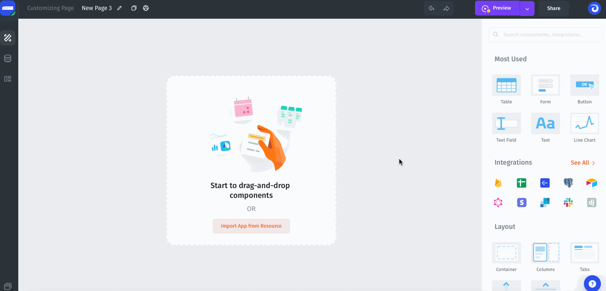
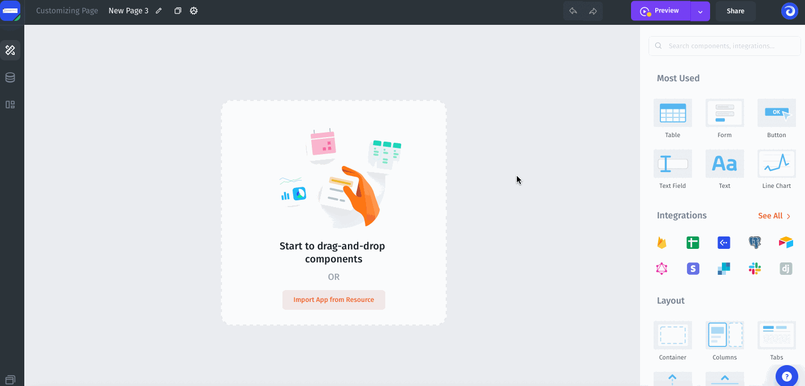

# 🧰 Data Sources

Jet Admin connects a lot of resources you need to build your internal tools. A few of our integrations:

* **Databases**: [PostgreSQL](/broken/pages/-LzjXXIXBtK-tlT1Auh5), [MySQL](/broken/pages/-LzjXXIXBtK-tlT1Auh5), [Microsoft SQL](/broken/pages/-LzjXXIXBtK-tlT1Auh5), [Oracle](/broken/pages/-LzjXXIXBtK-tlT1Auh5), [SQLite](/broken/pages/-LzjXXIXBtK-tlT1Auh5), [Firebase](firebase-firestore/)
* **Internal** [REST APIs](rest-api/) and [GraphQL](graphql.md)
* **Business apps**: [Stripe](stripe.md), [SendGrid](sendgrid.md), [Zendesk](zendesk.md), etc
* **Frameworks**: [Django](django-framework-package.md)

.png>)

### 1. Adding resources from Data section

You can add an unlimited number of resources from the available resources by going to the Data section:

### 2. Adding a resource from Page

Simply hit the **Import App From Resource** button to select the resource you want to integrate with Jet.

You can also add any resource directly from the component Data settings:


[Broken link](/broken/pages/-LzjXXIXBtK-tlT1Auh5)

