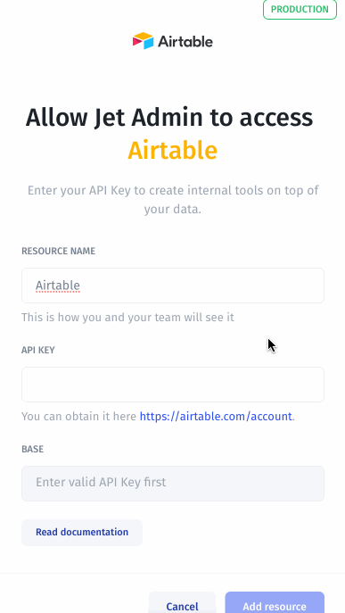

# Airtable

Connect to Airtable to turn your spreadsheets into a full-fledged internal tools or customer portals.

### 1. Add Airtable resource

Simply select Airtable from the list of resources in the welcome popup right after creating your project to get started:

### 2. Enter an API key

You can obtain your API key by following this [link](https://airtable.com/account) according to the following steps:

### 3. Pick your bases

Just choose your base that you want to allow Jet to work in order to build your application:

