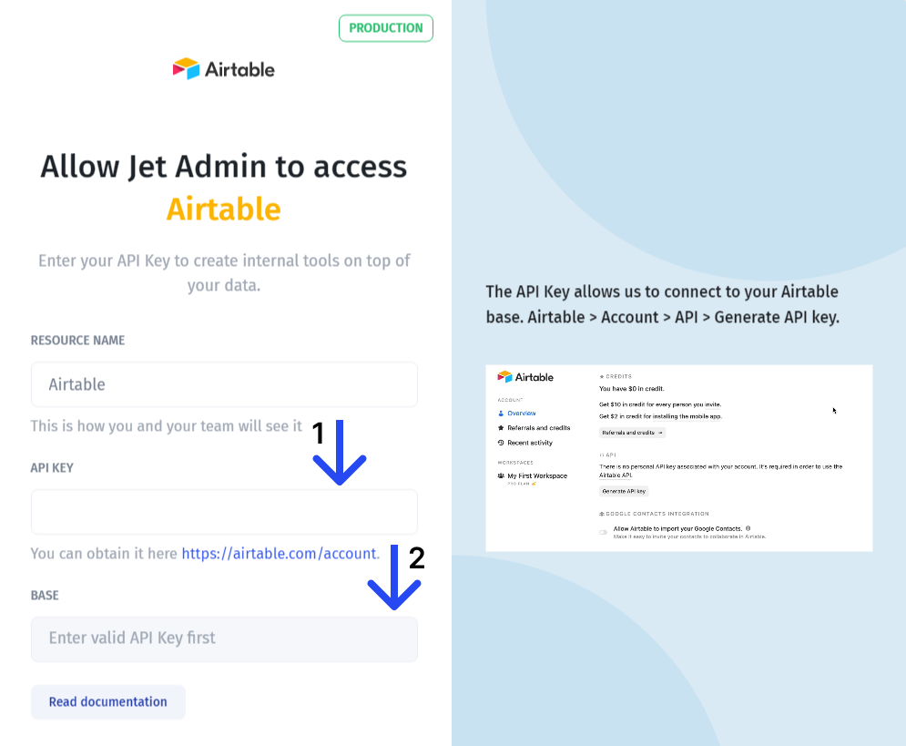
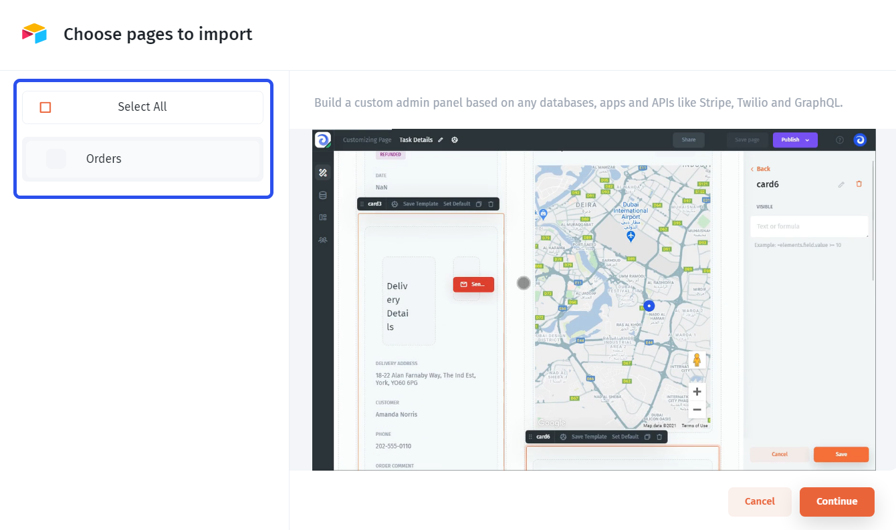

# Airtable

In this article, we'll review the integration with Airtable, and its characteristics and will go through the steps necessary to connect it to Jet Admin



### Connecting Airtable

You can connect to Airtable from the data tab on the left menu bar or from the data section within a UI component. You'll need to enter a valid API key (1) and choose a base (2).


Unlike in Airtable, in Jet Admin you can link between bases.




### Entering an API key

You can obtain your API key by following this [link](https://airtable.com/account) and following these steps:

### Choosing connection mode&#x20;

After that, you need to choose how you'd like your Airtable to be integrated with Jet Admin. You can either connect directly or **sync it** with Jet's internal database to get extended functionality.&#x20;

If you want to be able to **combine your Airtable data** with data from other data sources, such as Firebase, Google Sheets, or even REST API within the same tables, you should choose the **"Sync" connection** for Google Sheets. You can learn more about it here:


[360-data-data-blending](../360-data-data-blending/)


After having connected your Airtable, you'll be prompted to choose pages you want Jet Admin to generate **an admin panel (CRUD pages)** for. If you don't want an admin panel to be generated at all, leave all the boxes empty.

