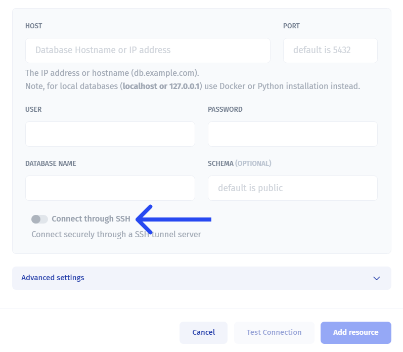

# Database resources

## Connecting database as a resource

We support direct connection to various databases, as well as connections to 3rd party database services.

To connect a database with **Jet Admin**, choose a database from the list of available integrations:

.png>)

### List of available databases:

* Jet Tables (PostgreSQL hosted in Jet Admin Cloud)
* PostgreSQL
* MySQL
* Microsoft SQL
* MariaDB
* SQLite (Instant Connection unavaliable)
* Oracle
* AlloyDB

### List of avaliable 3rd party databases:

* [Supabase](../supabase.md)
* [Airtable](../airtable.md)
* [Google Sheets](../../../videos/connecting-data-sources/google-sheet.md)
* [Firebase](../firebase-firestore/firestore.md)
* [Xano](../xano/)
* BigQuery
* [Snowflake](../snowflake.md)
* [SmartSuite](../smartsuite.md)
* Microsoft SQL
* Amazon Redshift

After choosing a database, you'll need to choose set up method.


Set up methods may vary depending on database you choose.


Use [instant cloud](instant-cloud.md) installation to connect Jet Admin with your public database directly (you won't be able to connect to localhost databases).&#x20;

We also provide [Jet Bridge](../../../jet-bridge-deployment/jet-admin/) to manage data in case you want to add an extra layer of security for your sensitive data. It will connect to your database and link **Jet Admin** with your project. It will work even with your application on **localhost**. Use [Docker](docker-installation.md) or [Python](python-app-installation.md) Installation to deploy Jet Bridge.

.png>)


[instant-cloud.md](instant-cloud.md)



[docker-installation.md](docker-installation.md)



[python-app-installation.md](python-app-installation.md)


### Deploy database to Heroku

An example of database deployment on Heroku and further Instant method integration.


[database-heroku-deployment.md](../../../jet-bridge-deployment/database-heroku-deployment.md)


### Connect through SSH

You can use SHH to **safely integrate** with databases in Jet Admin, if databases support it. Simply enable the toggle here and paste the credentials:

### Make an SQL queries

Using Database integration you can make simple or [SQL queries](../../data/make-a-sql-query.md) to your database to select the data and use it as virtual tables:




[make-a-sql-query.md](../../data/make-a-sql-query.md)


