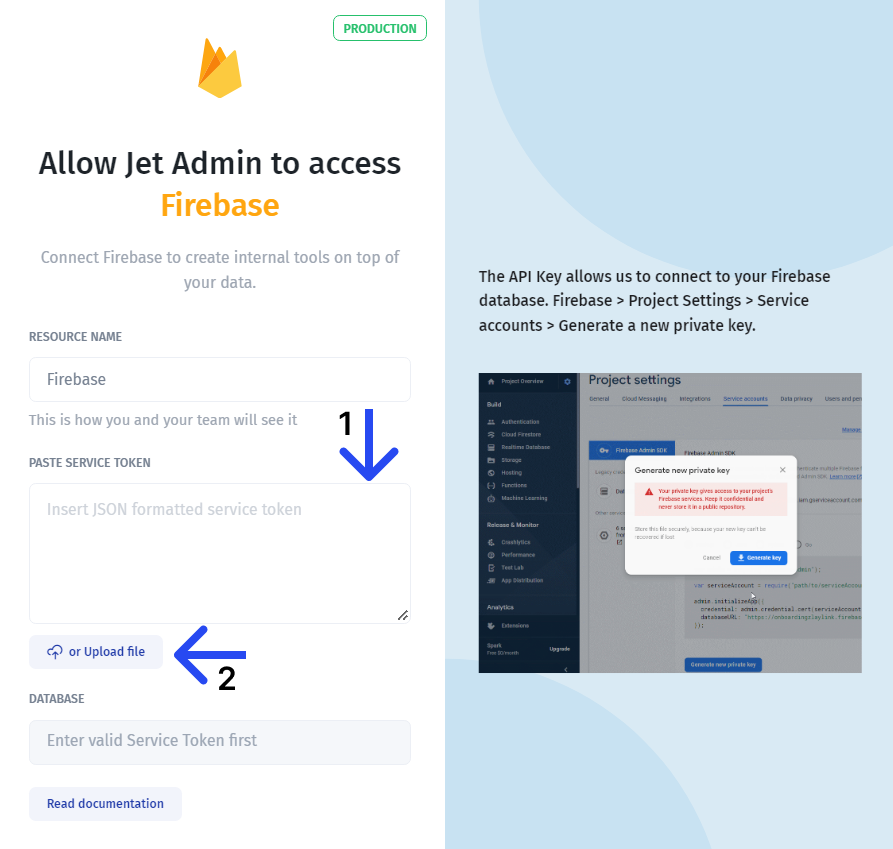
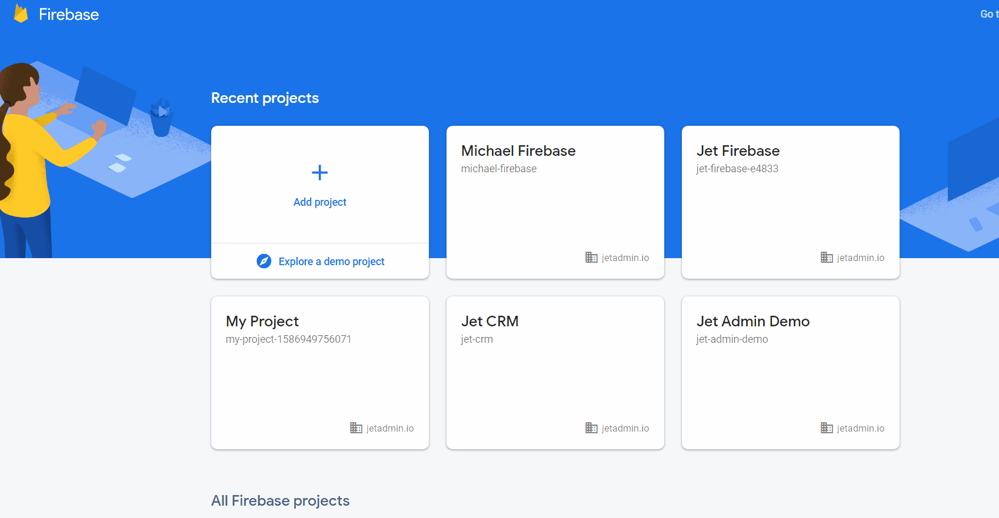
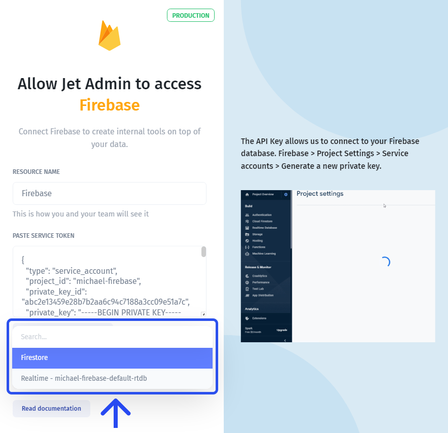

# Firebase

In this article, we'll review the integration with Firebase, and its characteristics, and will go through the steps necessary to connect it to Jet Admin

### Connecting Firebase

You can connect to Firebase from the new app flow, from the data tab on the left menu bar, or from the data section within a UI component.

Then, you'll need to provide a **service token** to allow your Firebase to interact with Jet. You can either copy and paste a JSON snippet (1) or upload it as a file (2):

To obtain a service key, go to your Firebase console, select a project, then proceed to the "Service accounts" section and click "Generate new private key":

Then you'll need to select the database type: Firestore or Realtime DB:


To learn more about Firestore and Realtime DB, check the [**official Firebase article**](https://firebase.google.com/docs/database/rtdb-vs-firestore)****


You can also watch our quick video on Firebase to learn how to quickly build admin panels or CRUD apps with Firebase:&#x20;



Further steps vary based on the type of database you want to connect to: Firestore or Realtime DB. Please check the pages below for each type:


[firestore.md](firestore.md)



[realtime-database.md](realtime-database.md)


