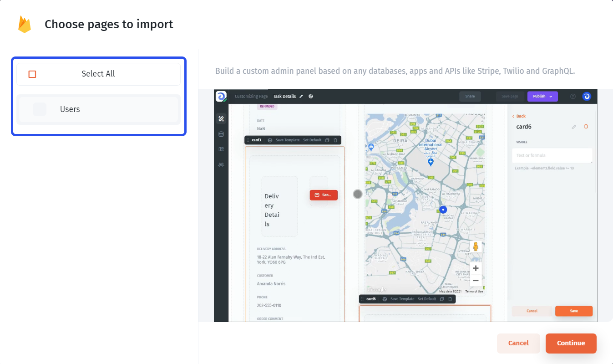

# Firebase

In this article, we'll review the integration with Firebase, and its characteristics, and will go through the steps necessary to connect it to Jet Admin

### Connecting Firebase

You can connect to Firebase from the new app flow, from the data tab on the left menu bar, or from the data section within a UI component.

Then, you'll need to provide a **service token** to allow your Firebase to interact with Jet. You can either copy and paste a JSON snippet **(1)** or upload it as a file **(2)**:


**It's critical** to have a **proper data structure** in your Firebase database, otherwise, Jet might not detect all or some parts of it. To learn, how to properly structure your data, read the [official Firebase article](https://firebase.google.com/docs/database/web/structure-data).


To obtain a service key, go to your Firebase console, select a project, then proceed to the "Service accounts" section and click "Generate new private key":

Then you'll need to select the database type: Firestore or Realtime DB:


To learn more about Firestore and Realtime DB, check the [**official Firebase article**](https://firebase.google.com/docs/database/rtdb-vs-firestore)****


Further steps vary based on the type of database you want to connect to: Firestore or Realtime DB.

### Firestore

If you selected a Firestore database, you'll be prompted to choose the **connection mode**.

Here, you need to choose how you'd like your Firestore to be integrated with Jet Admin. You can either connect directly or sync it with Jet's internal database to get extended functionality.&#x20;

If you want to be able to **combine** your **Firestore data** with data from other data sources, such as Google Sheets, Airtable, or even REST API within the same tables, you should choose the **"Sync" connection**. You can learn more about it here:


[data-blending.md](../../data-blending.md)


After having connected your Firestore, you'll be prompted to choose collections you want Jet Admin to generate **an admin panel (CRUD pages)** for. If you don't want an admin panel to be generated at all, leave all the boxes empty.

You can also watch our video on Firebase to learn how to quickly build **admin panels** or **CRUD apps** with Firebase:&#x20;



### Realtime DB

To learn how to configure your Realtime DB data, read the page below:


[realtime-database.md](realtime-database.md)

