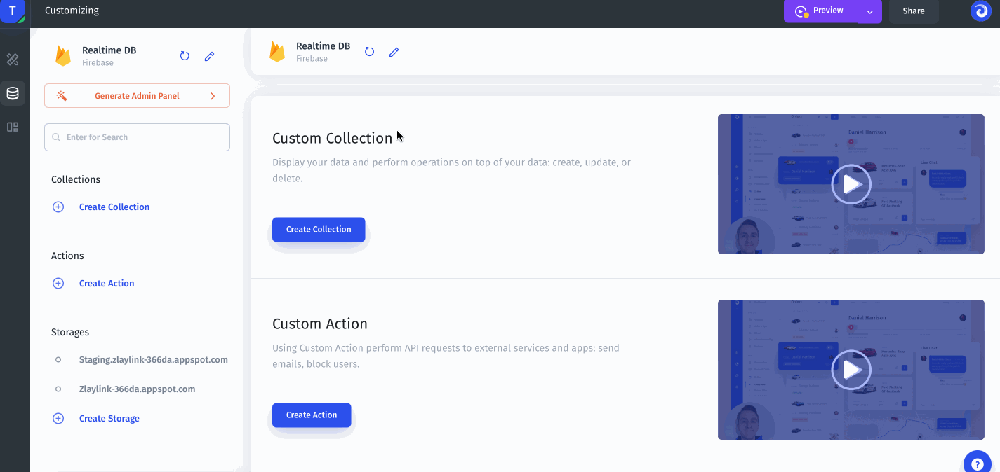
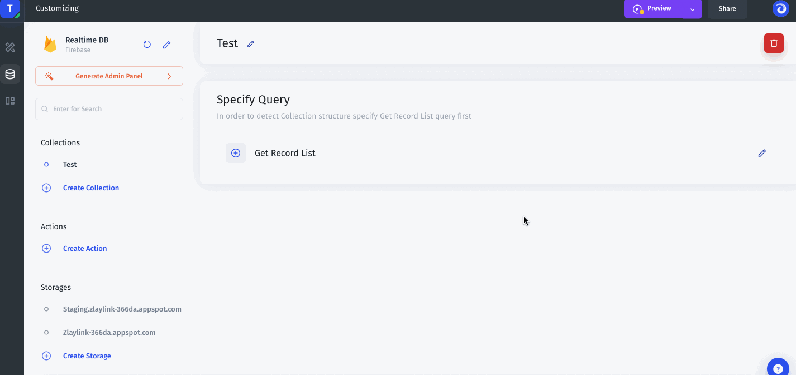
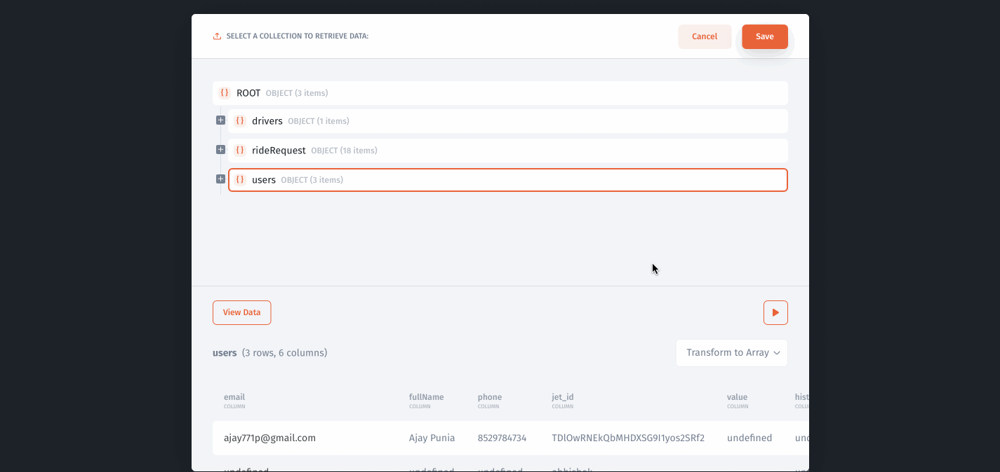

# Realtime DB

### Preparing your data with RealtimeDB Builder

Once you have added your resource you will be prompted to create a collection to start preparing your data:

To display your data, you need to define the data structure of your collection. To do this, click the Get Record List button to select the collection to display from your database:

Next, you need to save the query so you can use this collection in components:

