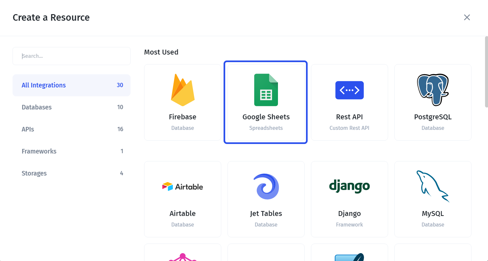
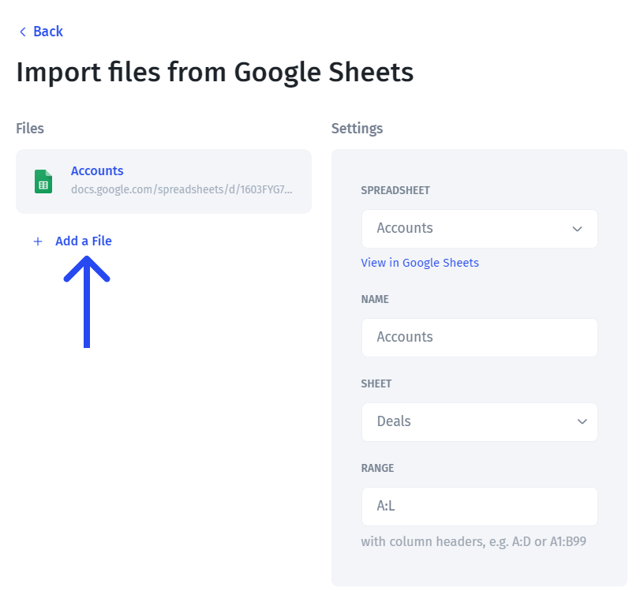
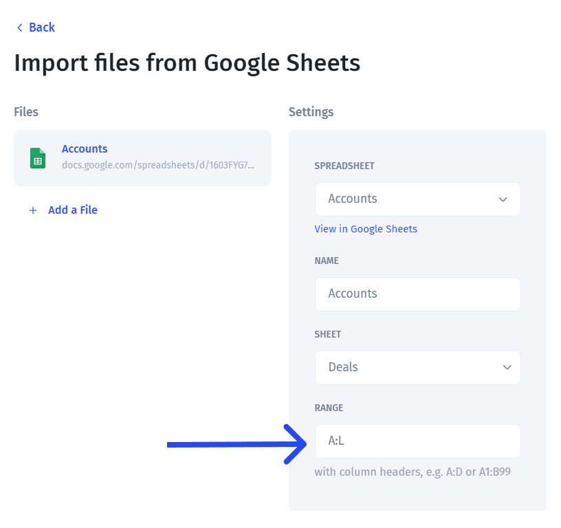

# Google Sheets

**Google Sheets** is one of the most popular databases that is often also used as a user interface. Connecting Google Sheets to Jet Admin doesn't require any coding.&#x20;

### Connecting Google Sheets

You can choose multiple files to import, for that, click "Add a file" as shown on the screenshot.

By default, Jet Admin automatically detects a **column range** and sets it based on the first and the last non-empty column. You can manually change the range as shown on the screenshot below.

After that, you need to choose how you'd like your Google Sheet to be integrated with Jet Admin. You can either connect directly or sync it with Jet's internal database to get extended functionality.

### Joining Sheets data with other data sources

If you want to be able to **combine your Google Sheets data** with data from other data sources, such as Firebase, Airtable, or even REST API within the same tables, you should choose the **"Sync" connection** for Google Sheets. You can learn more about it here:


[data-blending.md](../data-blending.md)


### Limitations

It's essential to be aware of the limitations of Google Sheets while working in Jet Admin. There are two major limitations:

1. **Number of rows per minute** - this is the limitation that comes from Google Sheets API limits (read more [here](https://developers.google.com/sheets/api/limits)). So if you build a complex tool with lots of data, it might make sense to look for an alternative to Google Sheets
2. **Working with formulas** - Jet Admi supports formulas in Google Sheets for reading, which means that calculated fields in your Sheets. However, if you will change (Through Jet Admin) a value that's a result of a formula, it will be written as a value and the formula information will be lost for that field.

