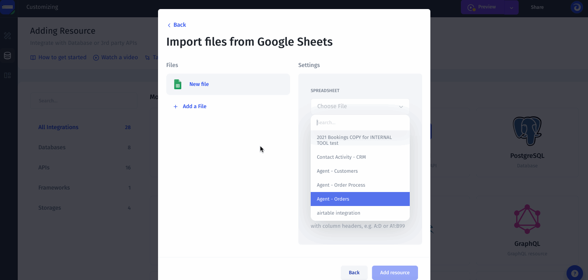

# Google Sheets

### 1. Add Google Sheets resource

To add Google Sheet to your project, simply click on the icon in the resource list.

.png>)

Then you need to sign in to your Google Account with the spreadsheets, choose the spreadsheets you want to add and simply click the **Add Resource** button.&#x20;

Once you've added Google Sheet to Jet Admin, you'll be able to see your Collections of data we obtained from your resource, such as Users. Select the collections for which Jet Admin should automatically generate an Admin Panel:

