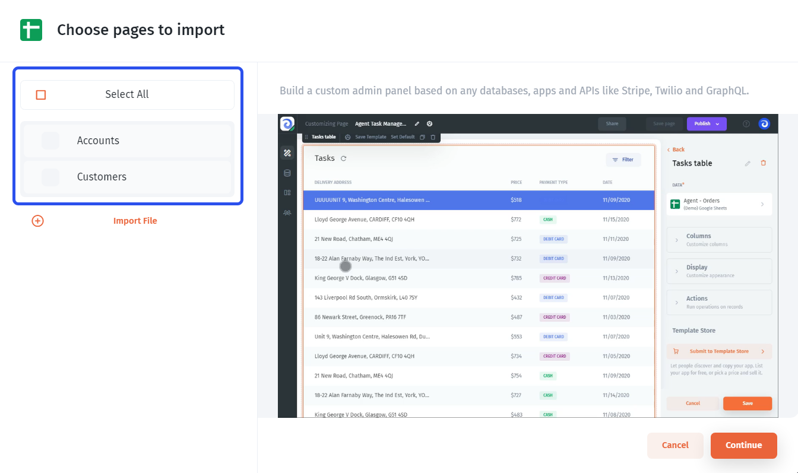

# Google Sheets

**Google Sheets** is one of the most popular databases that is often also used as a user interface. Connecting Google Sheets to Jet Admin doesn't require any coding.&#x20;

### Connecting Google Sheets

You can choose multiple files to import, for that, click "Add a file" as shown on the screenshot.

By default, Jet Admin automatically detects a **column range** and sets it based on the first and the last non-empty column. You can manually change the range as shown on the screenshot below.

After that, you need to choose how you'd like your Google Sheet to be integrated with Jet Admin. You can either connect directly or sync it with Jet's internal database to get extended functionality.

If you want to be able to **combine your Google Sheets data** with data from other data sources, such as Firebase, Airtable, or even REST API within the same tables, you should choose the **"Sync" connection** for Google Sheets. You can learn more about it here:


[data-blending.md](../data-blending.md)


After having connected your resource, you'll be prompted to choose pages you want Jet Admin to generate **an admin panel (CRUD pages)** for. If you don't want an admin panel to be generated at all, leave all the boxes empty.

