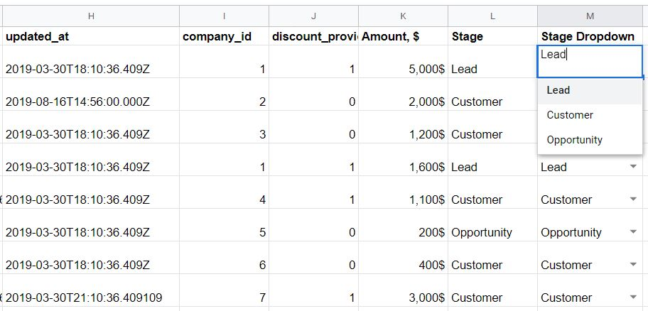
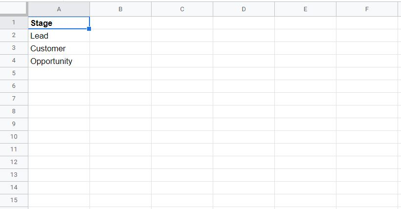
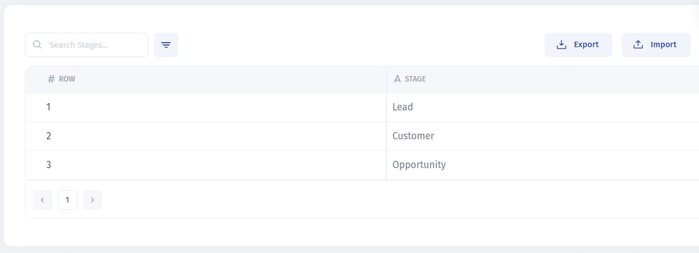
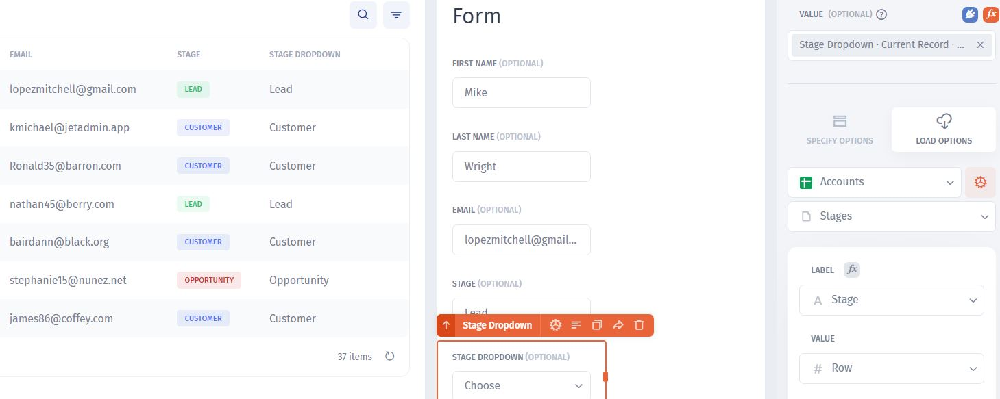

# Working with Data

**Contents:**

[Auto-generated row (primary key)](working-with-data.md#auto-generated-row-primary-key)

[Dropdowns](working-with-data.md#dropdowns)

[Limitations](working-with-data.md#limitations)

### Auto-generated row (primary key)

When you connect your Google Sheet table to Jet Admin or add new tables, Jet Admin automatically generates a row value (primary key) - a unique identifier of a given row.&#x20;

When you set up relations (binding) in Jet Admin or create pretty much any logic, Jet Admin uses `ROW` to identify the records. This field can not be deleted.

### Dropdowns

Dropdowns are used a lot in Sheets, but to make them work correctly when you connect your data to Jet, follow the instructions below

<figure><figcaption></figcaption></figure>

If you have dropdowns in your Sheet, and you want them to be transferred into Jet, you can't do it directly. Instead, click add a new file and choose the sheet that contains all the options for the dropdown


The values should be **unique** (no duplicates) AND the sheet has to have a **header row**, otherwise Jet will use a real value as a header


<figure><figcaption></figcaption></figure>

After connecting it, it will look like this in Jet:&#x20;

<figure><figcaption></figcaption></figure>

Now, after building your interface or applying one of the ready-to-use templates, you need to configure your select (dropdown) field in Jet Admin. By default, it looks like a basic input:

<figure><figcaption></figcaption></figure>

To make it a dropdown with the correct options, proceed to the settings and change the type of the field to "Select"

<figure><figcaption></figcaption></figure>

The last thing that's left is to choose the "Load from resource" tab and then pick your Sheet that contains the dropdown options.

<figure><figcaption></figcaption></figure>

### Limitations

It's essential to be aware of the limitations of Google Sheets while working in Jet Admin. There are two major limitations:

1. **Number of rows per minute** - this is the limitation that comes from Google Sheets API limits (read more [here](https://developers.google.com/sheets/api/limits)). So if you build a complex tool with lots of data, it might make sense to look for an alternative to Google Sheets
2. **Working with formulas** - Jet Admin supports formulas in Google Sheets for reading, which means that calculated fields in your Sheets. However, if you will change (Through Jet Admin) a value that's a result of a formula, it will be written as a value and the formula information will be lost for that field.

&#x20;
