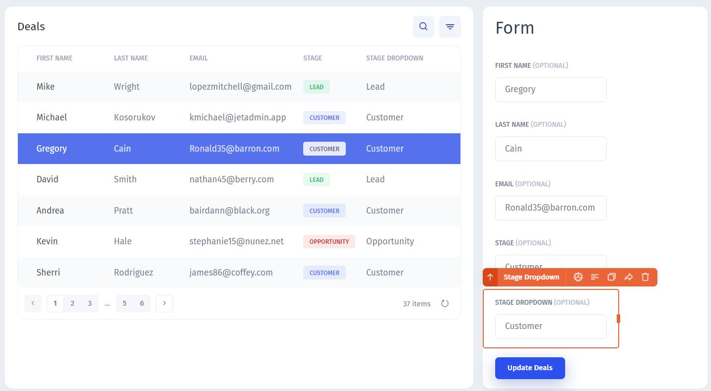

# Working with Data

### Auto-generated row (primary key)

When you connect your Google Sheet table to Jet Admin or add new tables, Jet Admin automatically generates a row value (primary key) - a unique identifier of a given row.&#x20;

When you set up relations (binding) in Jet Admin or create pretty much any logic, Jet Admin uses `ROW` to identify the records. This field can not be deleted.

### Dropdowns

Dropdowns are used a lot in Sheets, but to make them work correctly when you connect your data to Jet, follow the instructions below

<figure><figcaption></figcaption></figure>

If you have dropdowns in your Sheet, and you want them to be transferred into Jet, you can't do it directly. Instead, click add a new file and choose the sheet that contains all the options for the dropdown


The values should be **unique** (no duplicates) AND the sheet has to have a **header row**, otherwise Jet will use a real value as a header


<figure><figcaption></figcaption></figure>

After connecting it, it will look like this in Jet:&#x20;

<figure><figcaption></figcaption></figure>

Now, after building your interface or applying one of the ready-to-use templates, you need to configure your select (dropdown) field in Jet Admin. By default, it looks like a basic input:

<figure><figcaption></figcaption></figure>

To make it a dropdown with the correct options, proceed to the settings and change the type of the field to "Select"

<figure><figcaption></figcaption></figure>

The last thing that's left is to choose the "Load from resource" tab and then pick your Sheet that contains the dropdown options.

<figure><figcaption></figcaption></figure>

&#x20;
