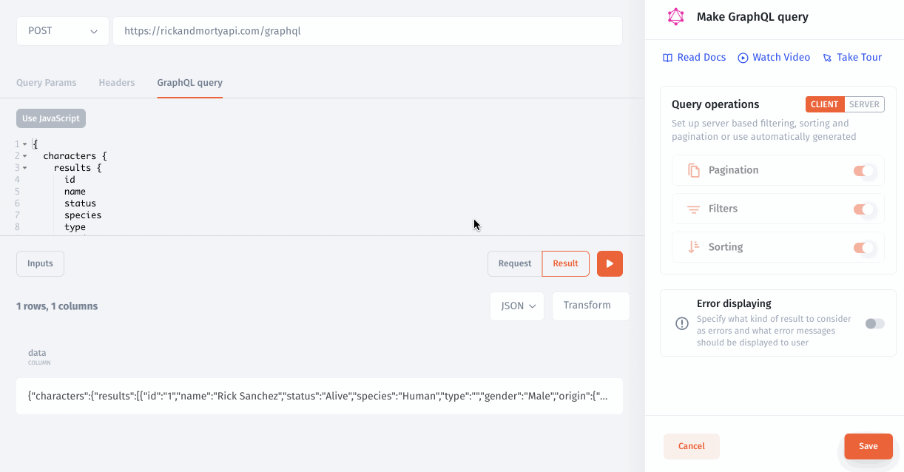

# GraphQL

GraphQL is an API design architecture that takes a different, more flexible approach. The key difference between GraphQL vs REST is that GraphQL doesn’t deal with dedicated resources. Instead, everything is regarded as a graph implying it’s connected.

What this means in practical terms is that you can tailor your request to match your exact requirements using the GraphQL query language. In addition to this, it lets you combine different entities into a single query.

A GraphQL query for a movie listings app might look something like this:

```graphql
{
  characters {
    results {
      id
      name
      status
      species
      type
      gender
      origin {
        name
        id
      }
    }
  }
}
```

### 1. Add your GraphQl resource&#x20;

To connect GraphQL to JetAdmin, add a new resource from the settings and select GraphQL or select GraphQL as the resource when creating a new project.


.png>)

Then, enter your API endpoint in the **Base URL** field. Base URL example:&#x20;

```
https://rickandmortyapi.com/graphql
```

.png>)

Depending on your API authentication settings, you may need to enter URL parameters or headers, or set the method via the [Authentication](rest-api/) dropdown.

### 2. Make a request

You can display the results of GraphQL queries as with any other query in Jet Admin.

```graphql
{
  characters {
    results {
      id
      name
      status
      species
      type
      gender
      origin {
        name
        id
      }
    }
  }
}
```



More information about HTTP Requests in our documentation.


[make-an-http-request](../data/make-an-http-request/)

