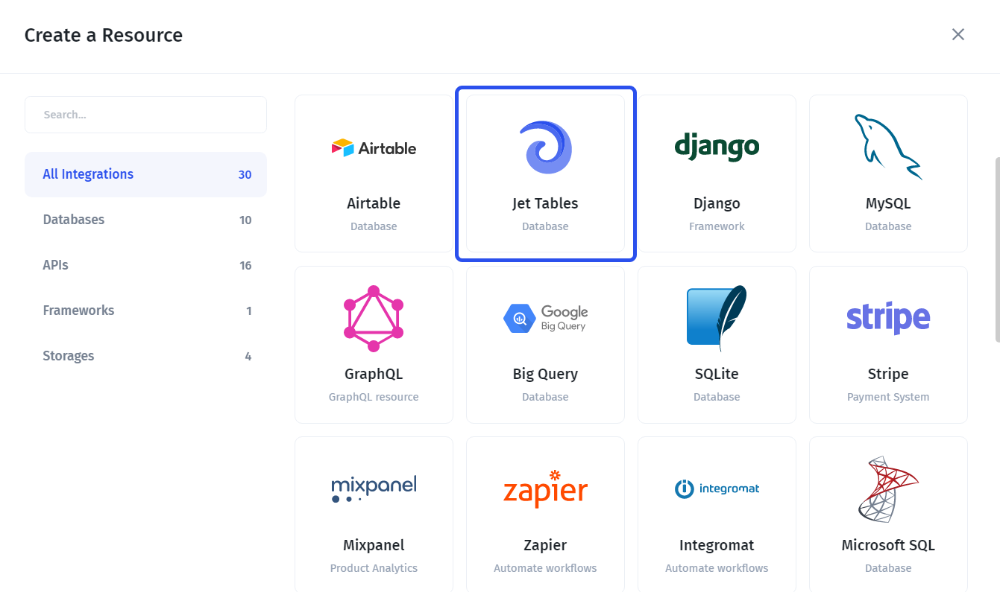

# Jet Tables

Jet Tables allow for a **quick and easy** building process, especially if you haven't committed to any particular database yet.

**To get started** with Jet tables, simply select it from the integrations list:

Then, you need to choose how you'd like to **create a new table**. There are two options:

* Import from a file (CSV, XLS, XLSX, JSON)
* Add an empty table
