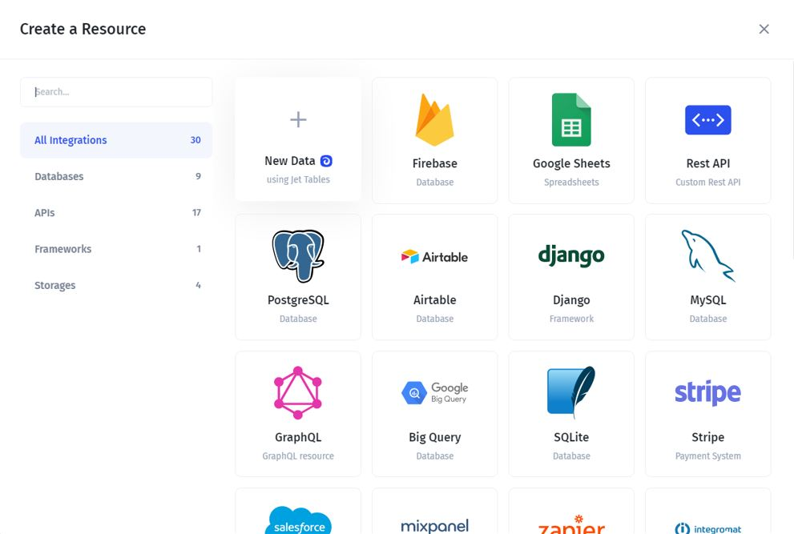
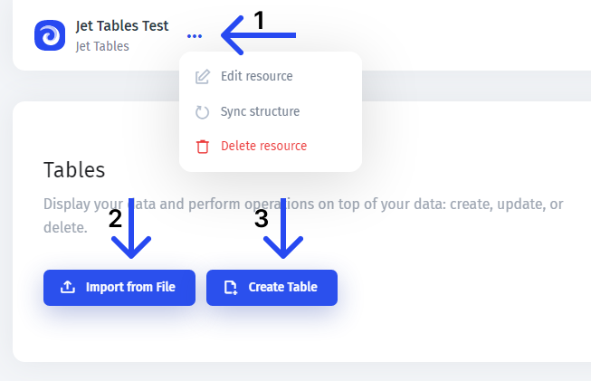
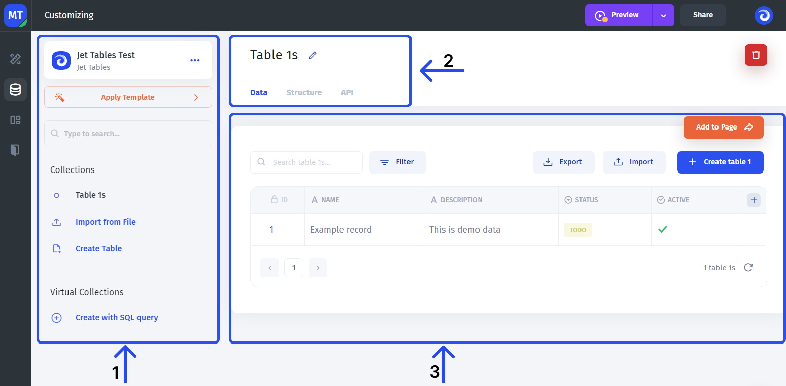
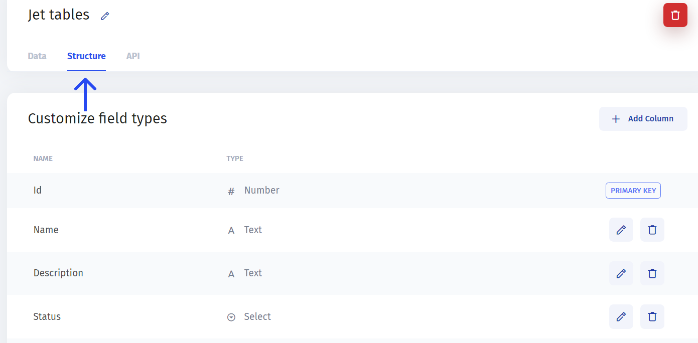

# Jet Tables

Jet Tables allows you to **get started** with your app really **quickly**. It especially comes in handy when you haven't committed to any particular database yet and want to have all the infrastructure in one place.


You can also use data from Jet Tables to [merge it](../../data-blending.md) with data from other data sources, write custom SQL on top of it and access it through [the API](https://docs.jetadmin.io/user-guide/jet-admin-api#resources-api).




### Creating a new resource

**To get started** with Jet tables, click "New Data" in the integrations list in the top left corner:

Then, you'll get to the page where you can set the initial configuration of your data source:

You can access the set-up menu by clicking the three dots next to the data source name **(1)**, where you can **change the name** or **delete** it.

You also get to choose how to **bring in your own data**: you can either create a table by uploading the existing data in CSV, XLS, XLSX, or JSON **(2)** or create a new blank table to add fields and values manually **(3)**.

### Setting up the data

Then you'll be taken to the main data section. There are three main areas or parts:

* **(1)** In the left part, you can **manage collections** (tables) and the resource (Jet Tables) itself
* **(2)** In the top part, you scope in onto the individual table that's been selected on the left. You can switch between the tabs to **change the structure**, and the **field types,** and access the **API**
* **(3)** Here you can **manage the table's data**: add new records, change fields, and add the new ones

Now, we'll look at how to manage the data inside of a particular table.


To learn about the **common** data section **functionality**, go to the [**data**](broken-reference) page


Now, to go from the dummy data to your own, there are two major paths:

* Import the data
* Edit the table directly

To **edit the data in the table** directly, you can edit the existing fields **(1)** and add new fields **(2)**

.png>)

You can do the same in the `Structure` tab:


**Id** field (also referred to as "primary key"), can not be changed or deleted as it's used as a unique identifier of a record

