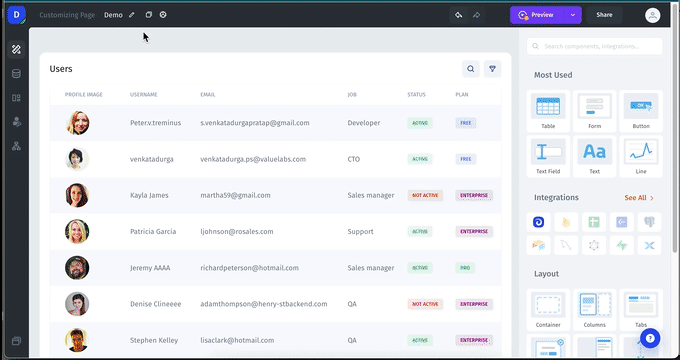

# MariaDB

### Connecting MariaDB

You can connect to MariaDB from the data tab on the left menu bar or from the data section within a UI component.&#x20;

<figure><figcaption>
Choose MariaDB from the list of integrations, enter the required details from MariaDB, and click "Add resource."
</figcaption></figure>
