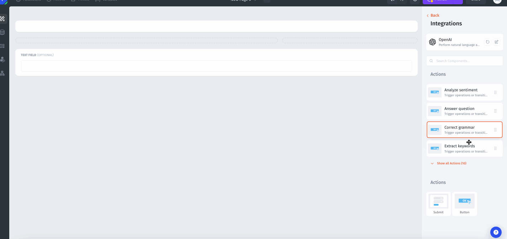

# OpenAI and Jet Admin

The integration with OpenAI empowers you to create text and images tailored to your prompts, harnessing the intelligence of OpenAI's language models. These models are designed to understand and craft text and images according to your needs. In Glide, you also have the flexibility to analyze and modify existing text and images, depending on the features you choose to utilize.

### Features Overview&#x20;

There are many possibilities with the OpenAI integration. You can:

* Analyze Sentiment
* Answer Question
* Send Message to ChatGPT (without history)
* Send Message to ChatGPT (with history)
* Correct Grammar
* Extract Keywords
* Generate Image
* Speech to Text
* Summarize
* Suggest a Color
* Suggest an Emoji

### Model Tweaks

**Temperature**

What sampling temperature to use, between 0 and 2. Higher values like 0.8 will make the output more random, while lower values like 0.2 will make it more focused and deterministic

**Max tokens**

The maximum number of tokens to generate in the chat completion. The total length of input tokens and generated tokens is limited by the model's context length. The maximum length parameter, limited to a number under 2048, governs the extent of the text generated, measured in tokens (words or symbols). Setting a higher value can lead to longer responses, although it may sacrifice coherence. Most models are restricted to a context length of 2048 tokens, but the latest models are capable of supporting up to 4096 tokens.

**How to use it:**

To use the OpenAI API in your app, the first step is to copy your secret API token from the OpenAI dashboard and paste it into the designated field. Note that the API requires a paid subscription plan for full functionality. If you already connected your app before subscribing, you may need to reconnect it to initiate the paid features.

With the API connected, you can leverage several different OpenAI executions like asking the AI questions and using its responses to trigger actions in your app. The possibilities are powerful and wide-ranging.

<figure><figcaption></figcaption></figure>
