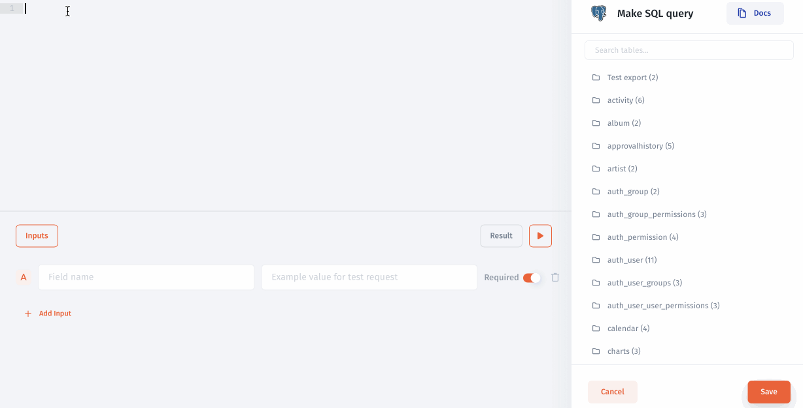

# Database Integration

To connect a database with **Jet Admin**, choose a database from the list of available integrations:

.png>)

Then choose a set up method. Use [instant cloud](instant-cloud.md) installation to connect Jet Admin with your public database directly (localhost not valid). If you care about your sensitive data we provide [Jet Bridge](../../../jet-bridge-deployment/jet-admin/) installation. It will connect to your database and link **Jet Admin** with your project. It will work even with your application on **localhost**. Use [Docker](docker-installation.md) or [Python](python-app-installation.md) Installation to deploy Jet Bridge.

.png>)


[instant-cloud.md](instant-cloud.md)



[docker-installation.md](docker-installation.md)



[python-app-installation.md](python-app-installation.md)


### Deploy database to Heroku

An example of database deployment on Heroku and further Instant method integration.


[database-heroku-deployment.md](../../../jet-bridge-deployment/database-heroku-deployment.md)


### Connect through SSH

You can use SHH to **safely integrate** with databases in Jet. Simply enable the toggle here and paste the credentials:

### Make a SQL queries

Using Database integration you can make simple or [SQL queries](../../data/make-a-sql-query.md) to your database:


[make-a-sql-query.md](../../data/make-a-sql-query.md)


