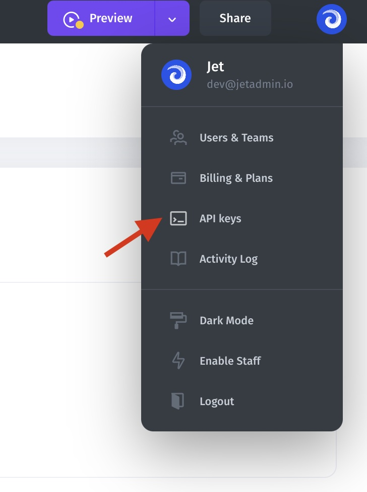

# Docker Installation

Integrate our [Jet Bridge](../../../jet-bridge-deployment/jet-admin/) plugin with Docker installation in one command. You can place it behind your VPN, in your own VPC, and works locally. We won’t get access to your data, however, you will still receive updates normally.

.png>)

#### Requirements:

* Docker installed
* localhost or web server with an external IP

#### Installation:

1\. Install [Docker](https://docs.docker.com/get-docker/) and make sure it works correctly.

2\. Install Jet Bridge container by running:&#x20;

```bash
sh <(curl -s https://app.jetadmin.io/install_jet.sh) {{Project Name}} {{Token}}
```


**{Project Name} and {Token}** is automatically generated when you connect **Resource**.



If you are using **Jet Bridge** just for HTTP requests (and not SQL) you can use **Project Token** as value for {Token}.


Go to the API key and below the API keys

********

Copy **UNIQUE APP NAME** and **JET BRIDGE TOKEN.**

<figure><figcaption></figcaption></figure>

3\.  Finish your project installation by opening in your browser:\
**localhost** is your **Jet Bridge** HOST and **8888** is its PORT.

```bash
http://localhost:8888/api/register/
```


[data](../../data/)

