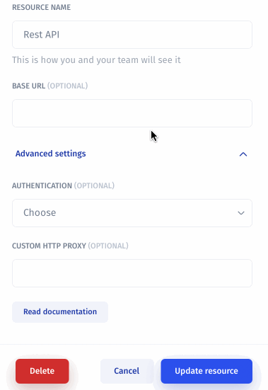

# OAuth 2.0

OAuth 2.0 is a security standard that allows a user (you) to authenticate one service (your API) to interact with Jet Admin on behalf of the user.

### What is OAuth 2.0?

OAuth 2.0 is a method in which Jet Admin obtains an **access token** to used to connect to an API. The token usually has a short life, generally around an hour, and each time it expires, Jet Admin will need to fetch a new token. That is done automatically with a refresh token that Jet also keeps.

When a token is issued to Jet Admin from your selected service, that token can only be used by Jet Admin to pull the data that was specified when the token was generated. The **refresh token** can also only be used by Jet Admin and can only be used to refresh the specific token that Jet Admin has. It's a very secure system, which is why the setup process can feel complex.

## Step by Step how to use the Jet Admin OAuth 2.0 form

### Step 1: Sign up an application to generate your OAuth credentials

All OAuth connections will require you to register an application with the service. Their documentation will provide instructions on how to go about doing that.

When you are registering your application, the service will ask for something along the lines of a Callback URL or a Return URI. Whatever variation of wording they use, you need to supply the service with this URL: `https://api-dev.jetadmin.io/api/create_oauth_token_complete/`

That is the URL that the service will use to send Jet Admin the access token for your account.

The service will provide you with at least two bits of information that we will refer to as **your credentials**. The service may give you more than just two, but there must be one that can serve as the `client_id` and one that can serve as the `client_secret`.&#x20;

### Step 2: Find your URLs

Jet Admin will use two URLs that are provided by your service to connect and stay connected via OAuth. The URLs are:

* A URL to display as a webpage to you so that you can authorize this connection. Many times called the **authorization URL**.
* A URL for Jet Admin to use to fetch your authorization token after you have confirmed that you would like the connection to exist. Many times the name of this URL involves the word token, like a **token URL**.

Your service may lay out its documentation for connecting to it via OAuth in a similar order as the above URLs. There are generally 3 or 4 steps to OAuth, each one using a different URL. First the authorization URL, then the token URL, then the refresh URL.

### Step 3: Find the parameters for each URL

When Jet Admin uses each URL, it will need some additional information to pass along to identify you to the service. This is where you will be using those credentials that you gathered in step 1.

**The Authorization URL**

The authorization URL may require you to send along one or two `parameters` to help identify who you are. Things like your `client_id` and other things may be required. This information in Jet Admin needs to be added to the URL itself like this:

`https://api.myservice.io/authorize?client_id={{cliend_id}}&session=true`

**The Token URL**

The token URL will specify which method or verb or request type to use to send the request. This is either a `POST` or a `GET`. Most likely, it is a `POST`. If it is a `GET`, then you need to send the required parameters in the URL, using the same method as we used for the authorization URL.

The following assumes that your URL requires a `POST` request to send the required data to your service from Jet Admin to get the access token.

The documentation of your service will tell you which values in the body parameters are optional and which are not. Usually, there is no need to send the optional parameters, but that is something to check case-by-case.

### Step 4: Fill in the form in Jet Admin

Fill in all necessary fields and click on the **Add Resource** button.

### Conclusion

Now you're done with OAuth 2.0 and ready to use it with Jet Admin. Here you can see an example of authentication with Google OAuth 2.0.


[google-oauth-2.0.md](../../security-and-privacy/sign-in-sign-up/google-oauth-2.0.md)

