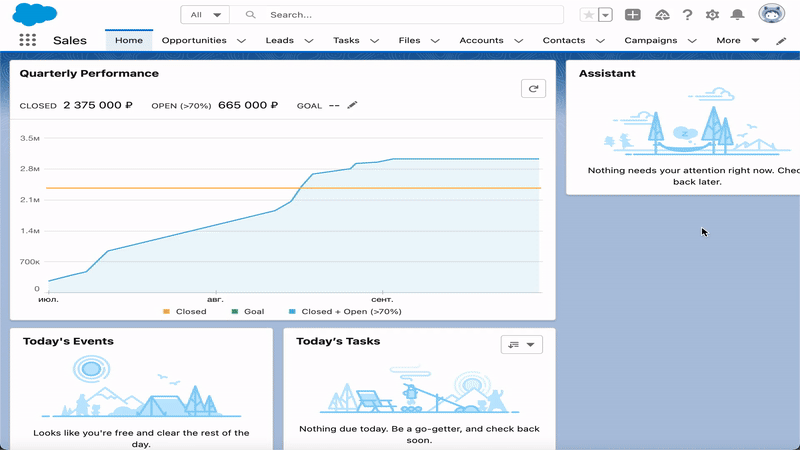

# Salesforce

Using Salesforce, you can do the following:

* View your top Salesforce customers alongside customer data stored in other Data Sources
* Share limited Salesforce data with your team or external stakeholders
* Keep your account team alerted

Jet syncs the following Salesforce data:

* Accounts
* Contacts
* Opportunities

## 1. Get Salesforce API Key

First, you need to sign up/sign in for Salesforce. Find and copy your API Key to connect Hubspot to Jet Admin.

<figure><figcaption></figcaption></figure>

