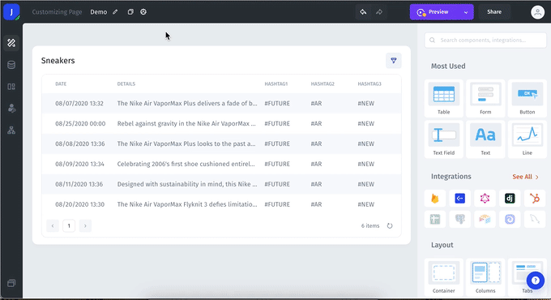

# Snowflake

### Connecting Snowflake

You can connect to Snowflake from the data tab on the left menu bar or from the data section within a UI component.&#x20;

<figure><figcaption>
Choose Snowflake from the list of integrations, enter the required details from Snowflake, and click "Add resource."
</figcaption></figure>
