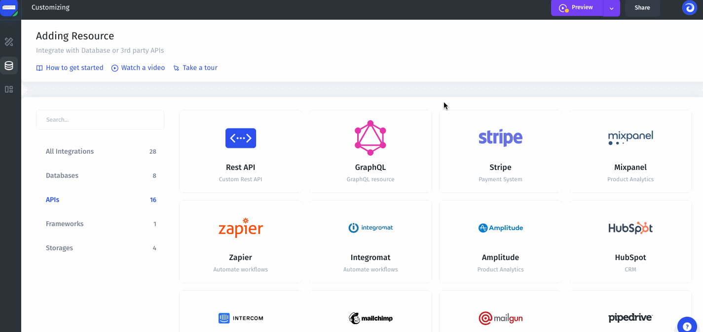

# Stripe

### 1. Get Your Secret API Key

To get your Secret API Key you need to sign up in [Stripe](https://stripe.com/). Then you need to find your Secret API Key:

.gif>)

Just click Reveal test key token to get your secret key.&#x20;

.png>)

### 2. Add to Jet Admin

Add Stripe to an existing project or connect Stripe as a resource when creating a new project. Copy your Secret API Key into the Secret Key field to connect the resource.

