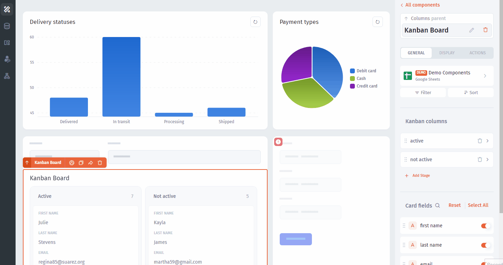

# Supabase

****[**Supabase**](https://supabase.com/) is an open-source Firebase alternative with an array of functions available out of the box.&#x20;

Using Supabase you can do the following:

* Build application: admin panel, internal tool, customer portal, or dashboard
* Manage your Supabase data: update, batch edit
* Build [workflow or automation](../workflow/) on top of your database

To Integrate Jet with Supabase and build your first app, follow our guide:

### Step 1: Set up your Backend on Supabase 

* On the [Supabase dashboard](https://app.supabase.com/), click `New project` and set the name to your **Project**

<figure><figcaption></figcaption></figure>

* Create a new table by clicking on the Create Table option on the side navigation.
* Supabase provides many ways fill the tables with data, from writing queries or creating schemas using UI to simply uploading CSV files.&#x20;

<figure><figcaption></figcaption></figure>

### Step 2: Connect the database to Jet Admin 

* Open up the database connection information section under Project Settings in Supabase.

<figure><figcaption></figcaption></figure>

Choose a **Supabase** database from the list of available data sources in Jet Admin:

<figure><figcaption></figcaption></figure>

The quickest way to integrate database is **Instant Connection** (**localhost** is not valid, use [**Docker**](postgresql-integration/docker-installation.md) **** or [**Python**](postgresql-integration/python-app-installation.md) **** integration instead). We encrypt all data and credentials that go through our servers using an HTTPS connection.

You'll need to fill out the following form:

.png>)

| Name               | Description                                                                                                                                                                                           |
| ------------------ | ----------------------------------------------------------------------------------------------------------------------------------------------------------------------------------------------------- |
| Host               | The IP address or hostname (db.example.com) of where your database instance resides. Note, `localhost` and **`127.0.0.1` are not valid!** Make sure it is accessible from these IPs: `95.179.253.121` |
| User               | Username for this database                                                                                                                                                                            |
| Password           | Password for this database                                                                                                                                                                            |
| Database Name      | The name of the database you would like to interact with.                                                                                                                                             |
| Database Port      | Port to connect to. By default PostgreSQL: 5432                                                                                                                                                       |
| PostgreSQL Schema  | Your database schema (`optional`)                                                                                                                                                                     |
| Extra Parameters   | Extra parameters, ex. charset=utf8 (`optional`)                                                                                                                                                       |

Now you're **ready to go!** The only thing that's left is to build an actual app on top of the data you brought in from Supabase

### Step3: Build an app on Jet Admin

Let's build Custom CRM using Jet Admin that allows everyone to **track** Opportunities: Value Deals, Deal Statuses, **update** Deals, and **send Slack notifications** when a Deal data is changed.

<figure><figcaption>
Custom CRM
</figcaption></figure>

#### 3.1 Configure Data Types

Go to your Data (in the data section) that was successfully imported from Supabase in previous steps and update **Field Types** to make your app look nice and polished.&#x20;

<figure><figcaption></figcaption></figure>

#### 3.2 Build App's UI

Create a new Page, drag-and-drop components to the canvas and connect these components with your Data.

#### Drag-and-drop UI components to the Canvas

<figure><figcaption></figcaption></figure>

#### Connect Data and Bind Componentsim

<figure><figcaption></figcaption></figure>

#### Configure UI components

Then fetch data from relevant collections in each UI component, using panel on the right


Note that each type of UI component might require different configuration. For the reference, see the [components section](../components/)


<figure><figcaption></figcaption></figure>

#### Enable filtering

Then select the Filter component and click "Bind" then choose the Kanban from the list - this will link the filter component and the kanban component so that any filter added will be applied to the kanban.

<figure><figcaption></figcaption></figure>

After this, add as many filters as you need - they all will have logical AND between them

<figure><figcaption></figcaption></figure>

#### Add record updating

To be able to change various fields from our Opportunities collection (that is fetched through the Kanban UI component) we've already added a Form component.

Now we need to make this form update a record that we selected in the Kanban on the left. To do this, we'll need to:&#x20;

**a)** Generate the form and&#x20;

**b)** Bind our form to the Kanban

Now, connect the form to our Opportunities collection and set what the Form will do (Update a record):

<figure><figcaption></figcaption></figure>

Follow up with binding the Form and finally, generating it

<figure><figcaption></figcaption></figure>

Now, we're halfway through. The only thing left is to make our app send notifications when we adit the Opportunity

#### Send notifications

To configure the notifications in Slack we'll need to create an **Automation** with data change in Opportunities collection as a trigger. You can find Automations in **the left panel**:

<figure><figcaption></figcaption></figure>

Then create **a trigger and an action** as it's shown on this GIF:

<figure><figcaption></figcaption></figure>

Then withing the _f_ `Formula` modal we can fetch **dynamic values** into our message and **customize** it using powerful Excel-like formulas

<figure><figcaption></figcaption></figure>

Here's an example of a message that informs about the `Status` change in the `Opportunities` collection&#x20;

<figure><figcaption></figcaption></figure>

#### 3.3 Share your app with teammates

Finally, go to Share -> Invite with Link (or use other invite options) to invite end-users and your team

<figure><figcaption></figcaption></figure>

