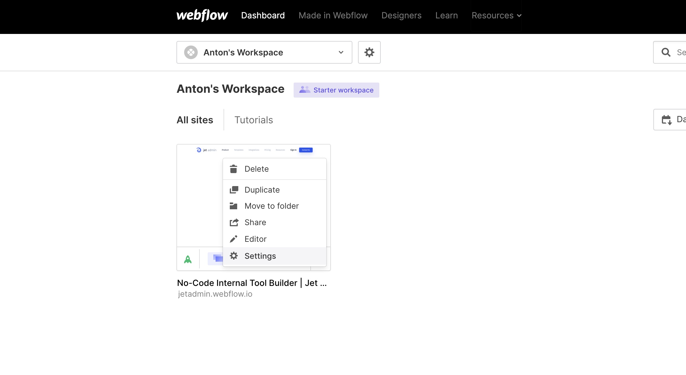
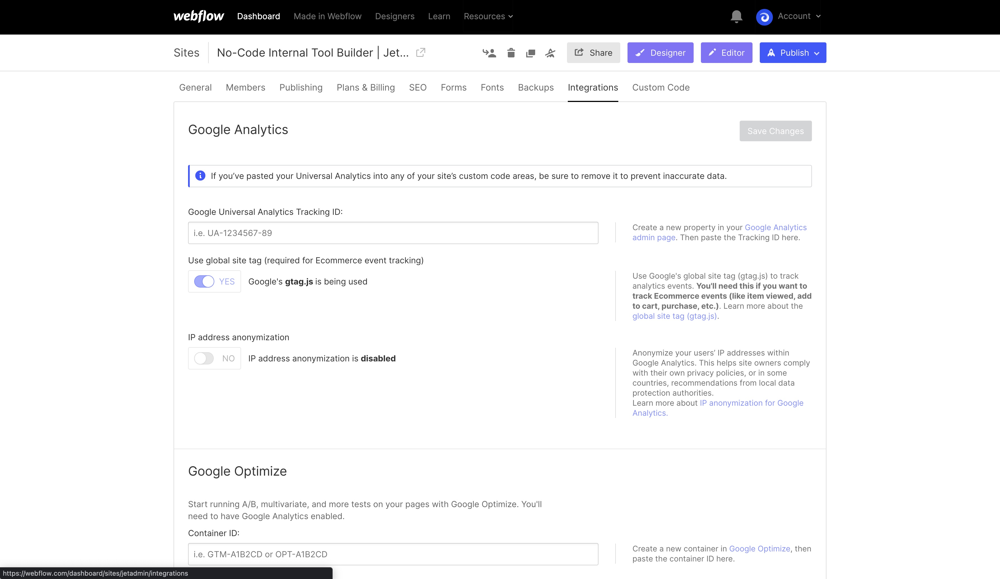
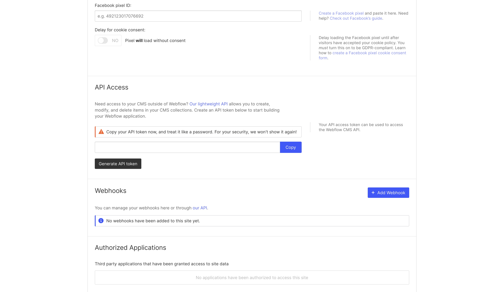
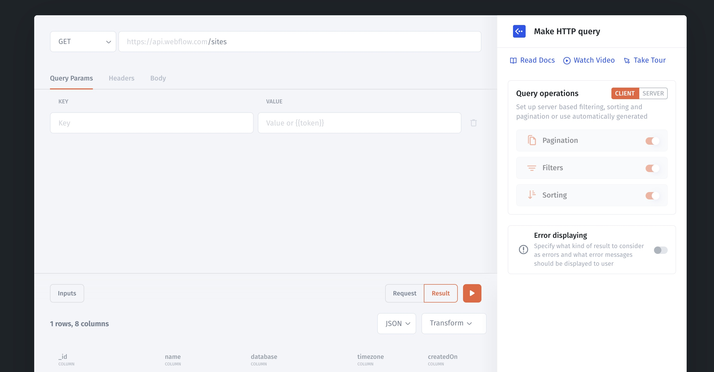

# Webflow

### Step 1: Get your API key 

Go to Webflow [Dashboard](https://webflow.com/dashboard) > **Settings**

<figure><figcaption></figcaption></figure>

Go to > **Integrations**

<figure><figcaption></figcaption></figure>

Scroll down to **API Access** > **Generate API token**

<figure><figcaption></figcaption></figure>

### Step 2: Connect the API queries to Jet Admin 

Choose a Rest API database from the list of available data sources:

<figure><figcaption></figcaption></figure>

Let's start with implementing **Rest API**, select it from the list of available resources, and specify the general information that will use for all API requests for this resource:&#x20;

* **Resource name** – unique name that indicates API resource in Jet Admin.
* **Base URL** – URL that will use for all requests for this resource (if you want to use different URL, create different resources for each URL).

<figure><figcaption></figcaption></figure>

Create a new Collection with your Webflow's query:

<figure><figcaption></figcaption></figure>


[make-an-http-request.md](../data/make-an-http-request.md)

