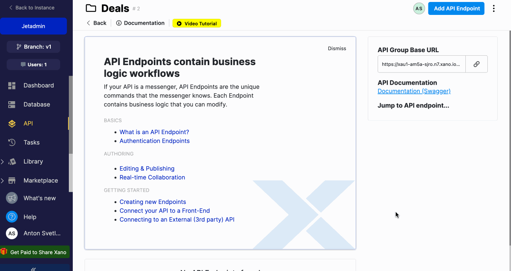

# Create APIs on top of your Xano database

Once you have created a Database and filled in data, you should create APIs for your Database in Xano. There are two options to create Endpoints in Xano:&#x20;

* Default CRUD operations endpoints&#x20;
* Create custom API endpoints

#### 1.1 Default CRUD operations endpoints

1. **Use Default CRUD operations endpoints**. Go to the **API tab** in Xano from the left menu and choose **Default** API Group and Copy **API Group Base URL to your clipboard, and let’s head over to Jet Admin!**

<figure><figcaption></figcaption></figure>

#### **1.2 Create custom API endpoints**

To successfully create custom API endpoints, mark all API endpoints: Specify the **Description** field for each API endpoint.

First, go to **Add API Group** and fill in Name and Description. Next, click **Add API endpoint**.

<figure><figcaption></figcaption></figure>

Fill the **Description** field of the API endpoint you want to use in Jet Admin with the following content:

* _For Get record list API endpoint:_ Query all **TABLE** records
* _For Create record API endpoint:_ Add **TABLE** record
* _For Delete record API endpoint:_ Delete **TABLE** record
* _For Get one record API endpoint:_ Get **TABLE** record
* _For Update record API endpoint:_ Edit **TABLE** record

where **TABLE** is your Xano table name.


Only endpoints with the specified **Descriptions will be imported** to Jet Admin. For example, if API endpoint – Get record list of Deals, in the Description field: **Query all deals records**.


### **Step 1.3: File upload API Endpoint (Optional)**


**Xano Files** attachments are only available in paid **Xano** plans


It's only possible to upload files to **Xano** file fields using **Xano Files** storage. If you have file fields in your **Xano** database then you need to connect **Xano Files** storage to **Jet Admin**. All **Xano** file fields will use **Xano Files** storage by default.

Jet Admin will automatically integrate with **Xano Files** storage if you have **Xano** an **/upload/attachment** endpoint when you connect to **Jet Admin.**&#x20;


**Jet Admin** will look for **/upload/attachment** endpoint to integrate. \
If you already have it you can skip the following part.


If you don't have an **/upload/attachment** endpoint then follow these steps:&#x20;

* Go to your **API Group**
* Click **Add API endpoint**
* Create an endpoint by clicking **Upload Content** -> **Upload an attachment** -> **Save**

<figure><figcaption></figcaption></figure>

 

<figure><figcaption></figcaption></figure>

 

<figure><figcaption></figcaption></figure>

<figure><figcaption></figcaption></figure>

Once you finish the steps you will have the following **/upload/attachment** which will automatically integrate when connecting to **Jet Admin.**

<figure><figcaption></figcaption></figure>

###
