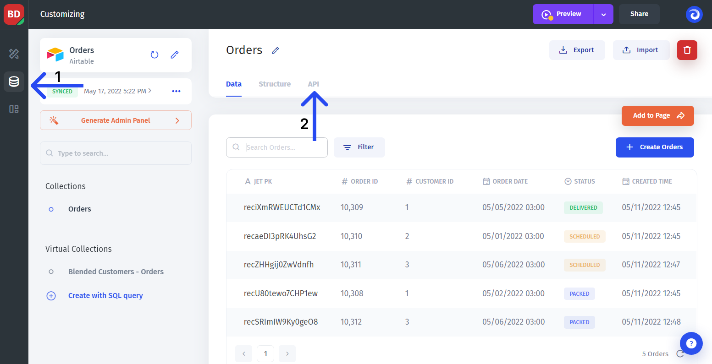
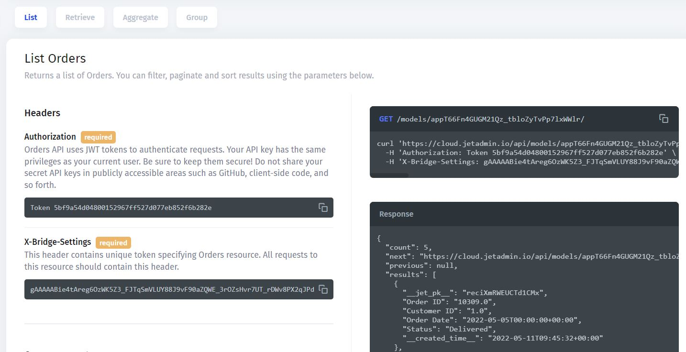

# 🛫 Jet Admin API

Jet Admin has its own API to manage users and teams as well as to interact with resources, connected to Jet Admin.

### Resources API

Jet allows you to **interact with data sources and APIs**, connected to Jet. The API documentation for each resource can be found in the data section within the particular resource page.&#x20;


To **be able to use API** for a particular datasource, you need to use the "Sync" connection when integrating a resource:


To get there, go to the data section **(1)**, choose the resource and then click the API tab **(2)**.

Then use the tabs and scroll to navigate the API documentation:


At the moment, the API documentation is available for a **limited number of integrations**. If you want us to prioritize a specific data source, please let us know in the support chat


### Users & Teams API

Firstly, to make requests to Jet's API you should **get a token**. Go to Project Settings -> Resources ->  Choose a one of resource and copy **Jet Bridge Token**

.png>)


[project-users.md](project-users.md)



[project-teams.md](project-teams.md)


