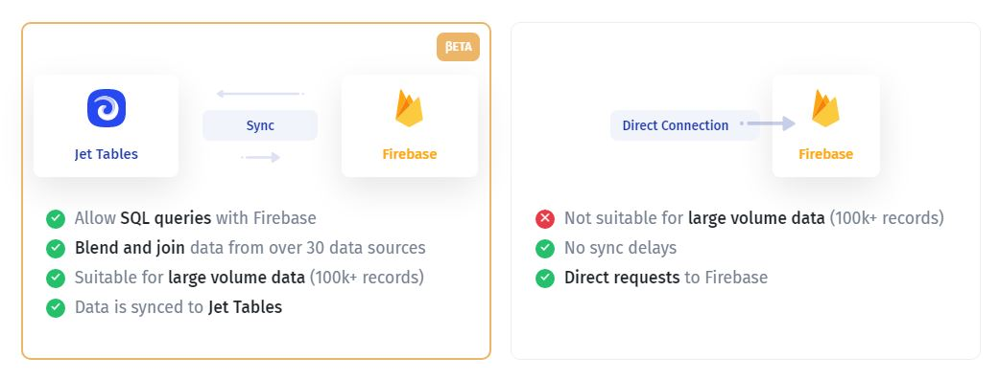

# 🛫 Jet Admin API

Jet Admin API makes extending your apps and accessing Jet Admin outside of the app easy. In just a few clicks, you can get access to lists of records, and individual records, create new rows, or update/delete existing ones through a RESTful interface. Make working with data more efficient in no time!

<figure><figcaption></figcaption></figure>

### Jet Admin API

Jet allows you to **interact with data sources and APIs**, connected to Jet. The API documentation for each resource can be found in the data section within the particular resource page.&#x20;


To **be able to use API** for a particular datasource, you need to use the "Sync" connection when integrating a resource:


To get there, go to the data section **(1)**, choose the resource and then click the API tab **(2)**.

<figure><figcaption></figcaption></figure>

Then use the tabs and scroll to navigate the API documentation:

<figure><figcaption></figcaption></figure>


At the moment, the API documentation is available for a **limited number of integrations**. If you want us to prioritize a specific data source, please let us know in the support chat


### Get API token

1. Go to **Profile** -> **API keys**

 (2).png>)

&#x20;

2\. Create a new **API Key**. You can generate several API keys

<figure><figcaption></figcaption></figure>

<figure><figcaption></figcaption></figure>

### Users & Teams API

Firstly, to make requests to Jet's API you should **get a token**. Go to Project Settings -> Resources ->  Choose one of the resources and copy **Jet Bridge Token**


[project-users.md](project-users.md)



[project-teams.md](project-teams.md)


