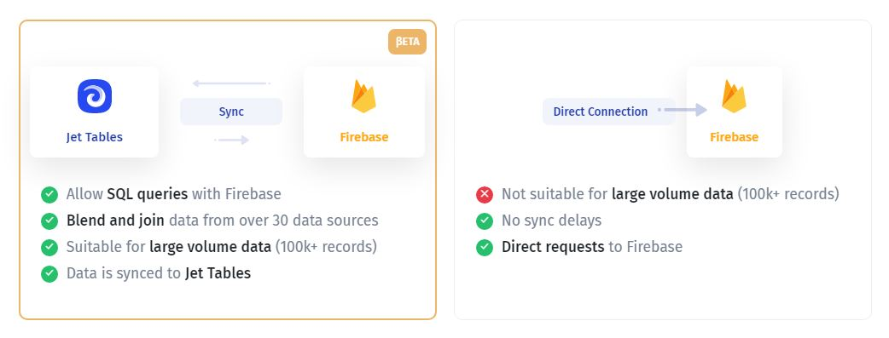

# Interacting with Jet Admin API

Jet allows you to **interact with data sources and APIs**, connected to Jet. The API documentation for each resource can be found in the data section within the particular resource page.&#x20;


To **be able to use API** for a particular data source, you need to use the "Sync" connection when integrating a resource:


To get there, follow the steps:

1. Go to the `Data` section
2. Choose the **resource**
3. Click on the `API` tab



Using the tab, scroll to navigate the API documentation.

<figure><figcaption></figcaption></figure>


At the moment, the API documentation is available for a **limited number of integrations**. If you want us to prioritize a specific data source, please let us know in the support chat.


