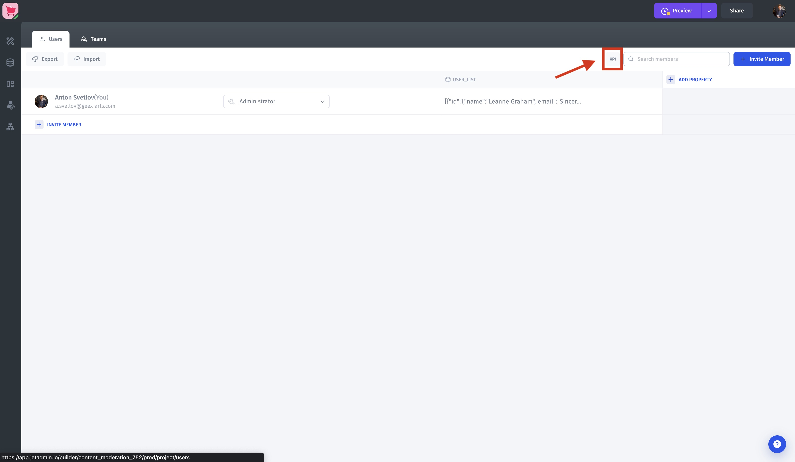

# Users API

To utilize the app **Users** through API, please refer to the interactive documentation:\
**Data -> Users -> API**


To update properties values use property **unique ID** (ie. 9pslwvhb) instead of property **display name** (ie. country). You can get in from the response example or by executing **List API** query.


<figure><figcaption></figcaption></figure>

<figure><figcaption></figcaption></figure>

<figure><figcaption></figcaption></figure>
