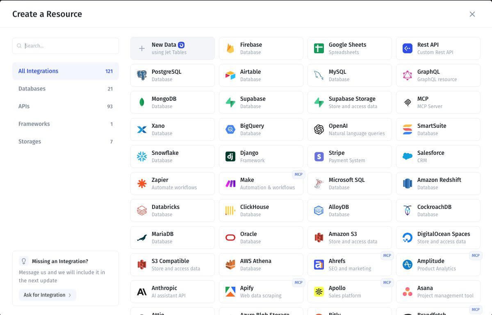
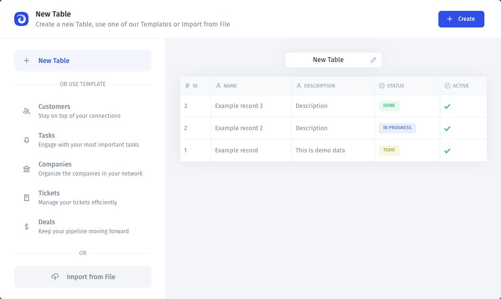
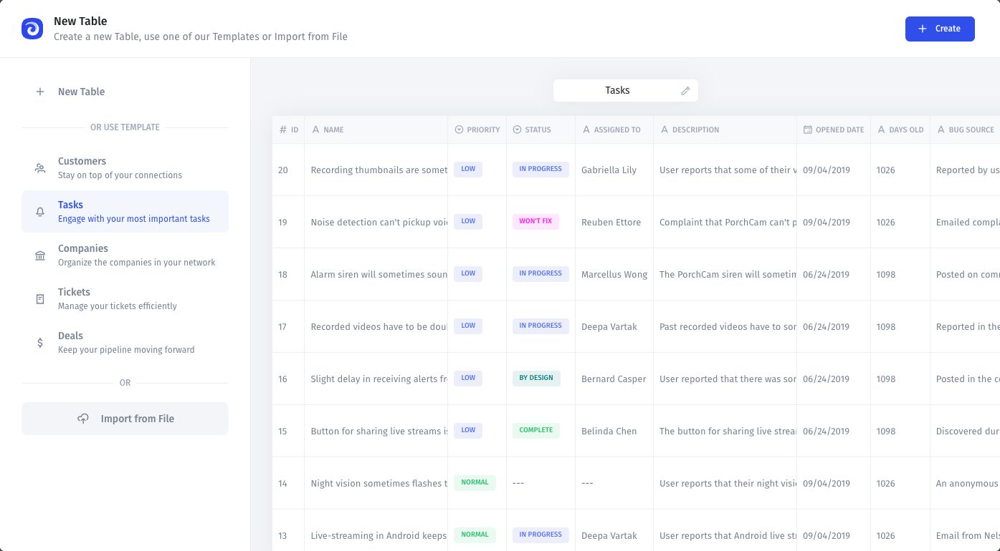
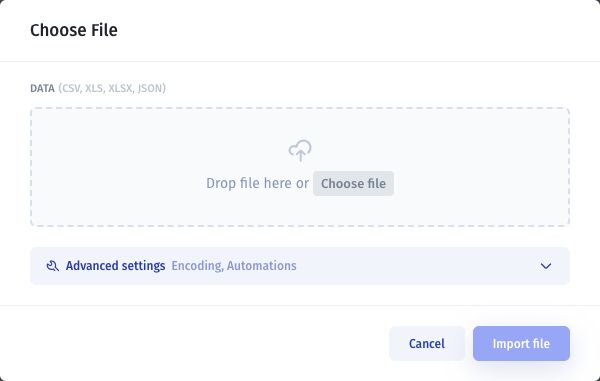
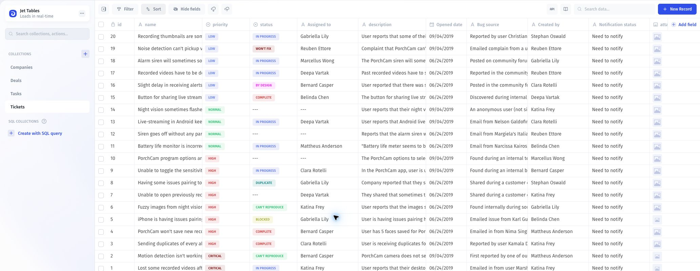
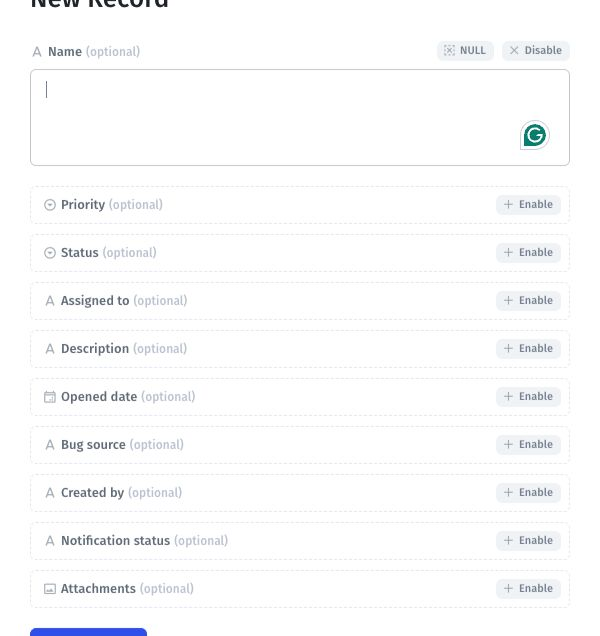
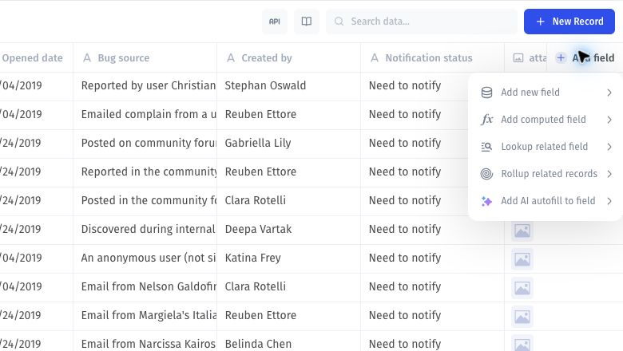

# Jet Databases

Jet Databases gives you a PostgreSQL database hosted by Jet Admin, with a spreadsheet-style interface for working with your data. In the resource picker, it is called **Jet Tables**.

You can edit, search, filter, and sort records; import or export CSV, XLS, XLSX, and JSON files; and query your data with SQL. You can also [combine data from other sources](synced-tables/) and access your tables through the [API reference](/broken/pages/-M2Ezm-MS-DTMS9hxOtE).



## 1. Open Jet Tables

1. Open your application and select **Data** in the top navigation.
2. Open the data resource menu and select **Add Resource**.
3. In **Create a Resource**, select **New Data — using Jet Tables**.

If you already have a Jet Tables resource, select it from the resource menu to work with its tables.

<figure><figcaption>
Select New Data to start with Jet Tables.
</figcaption></figure>

## 2. Create a table

The setup window offers three starting points:

| Option               | Use it to                                                                             |
| -------------------- | ------------------------------------------------------------------------------------- |
| **New Table**        | Start with the default example fields and records, then adapt the table to your data. |
| **Template**         | Start from a Customers, Tasks, Companies, Tickets, or Deals template.                 |
| **Import from File** | Bring in data from an existing file.                                                  |

### Start with New Table

1. Select **New Table**.
2. Use the pencil icon beside the table name to rename it. This walkthrough uses **Documentation Demo**.
3. Review the fields and sample records in the preview.
4. Select **Create** to create the table.

<figure><figcaption>
Name your table and review the preview before selecting Create.
</figcaption></figure>

### Start from a template

Select a template from the left sidebar to preview its fields and sample data. Rename the table if needed, then select **Create**.

<figure><figcaption>
The Tasks template provides a starting structure for tracking work.
</figcaption></figure>

## 3. Import an existing file

To start with your own data:

1. Select **Import from File** in the setup window.
2. Select **Choose File**, or drag a file into the upload area. Supported formats are **CSV, XLS, XLSX, and JSON**.
3. If needed, open **Advanced settings** to review the encoding and automation settings.
4. Select **Import file**.

<figure><figcaption>
Upload an existing file to bring your data into Jet Tables.
</figcaption></figure>

## 4. Work with your table

This walkthrough uses the **Tickets** template, populated with sample support tickets. To start with the same structure, choose **Tickets** in the template picker and select **Create**. If the table already exists, select **Tickets** under **Collections**.

### Explore the records

Each row is a ticket, and each column is a field. The template includes **name**, **priority**, **status**, **Assigned to**, **description**, **Opened date**, and other fields.

* Use the **Collections** sidebar to switch tables.
* Use **Search data…**, **Filter**, and **Sort** above the grid to find and organize tickets.
* Use **Hide fields** to focus on the columns you need.

<figure><figcaption>
The Tickets table displays sample records with colored priority and status values.
</figcaption></figure>

### Add a ticket

1. Select **New Record** in the top-right corner.
2. Select **Enable** beside each optional field you want to fill in.
3. Enter the ticket details, such as **Name**, **Priority**, **Status**, and **Description**.
4. Select **Create Tickets** to save the record.

<figure><figcaption>
Enable the fields you need, enter their values, and create the ticket.
</figcaption></figure>

### Add fields

Select **Add field** at the right end of the column headers. The menu lets you:

* **Add new field** to store another value on each ticket.
* **Add computed field** to calculate a value.
* **Lookup related field** or **Rollup related records** to use related data.
* **Add AI autofill to field** to configure AI-assisted field values.

Choose the option that matches your data, then complete its configuration.

<figure><figcaption>
Extend the Tickets table using the Add field menu.
</figcaption></figure>


The **id** field is the primary key: it uniquely identifies each record and cannot be changed or deleted.


For more about editing records, searching, filtering, and sorting, see the [Data guide](https://docs.jetadmin.io/user-guide/data). To work with records programmatically, see the [API reference](https://app.gitbook.com/o/-LQ08RF9M1pw0T-3zBQH/s/XFsHhniyCGLWr64BOU1D/).

## 5. Storage & Files. Working with Files in Jet Tables

Jet Storage allows you to work with files in Jet Admin without the need to hook up external storage like S3, Firebase storage, or Google Cloud Storage.


To read more about **how to use files**, please go to the [File component reference page](../classic-app-builder/design-and-structure/components/fields/file.md)


### Limitations

Storage limitation for your files depends on your [subscription plan](https://www.jetadmin.io/pricing).

